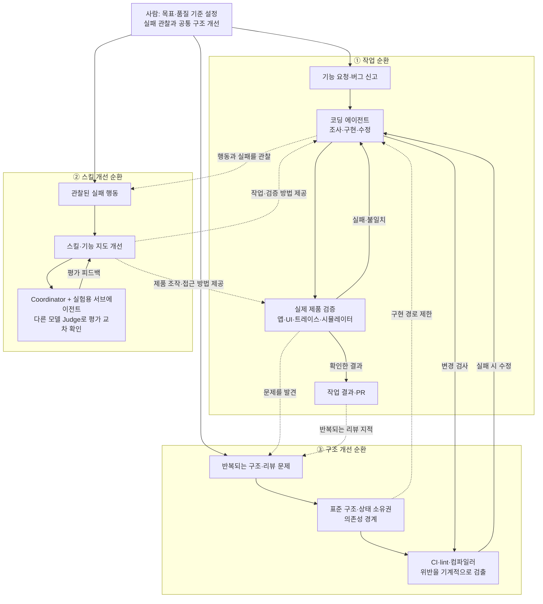
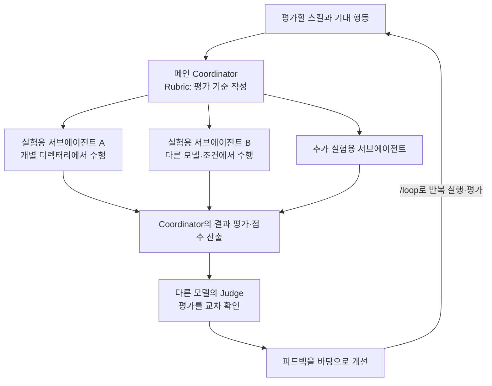
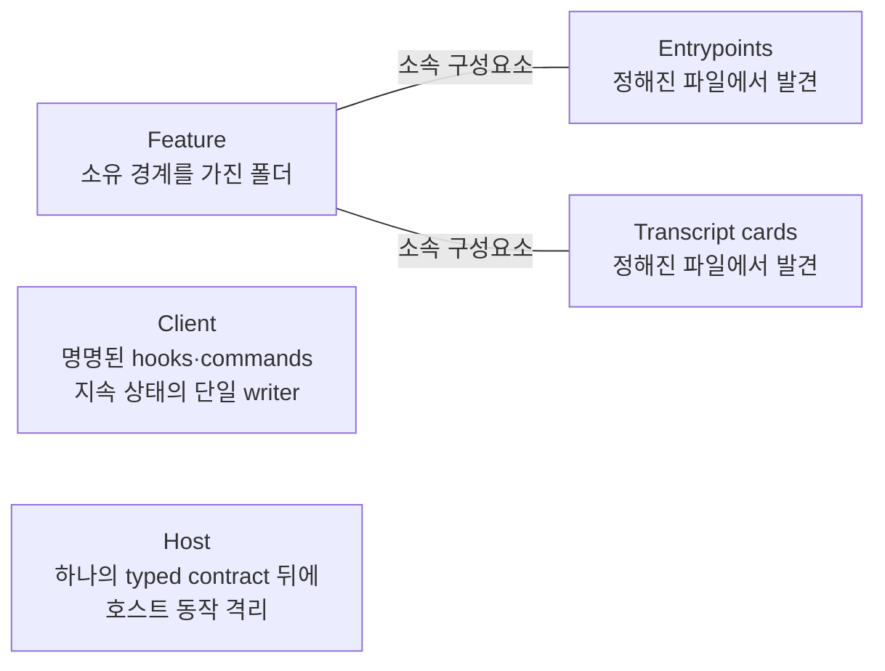

# Lauren Tan의 코딩 에이전트 운영 구조

## 작업·검증·스킬 평가·아키텍처 규칙을 연결한 통합 문서

작성일: 2026-09-29  
대상 자료: AgentOS의 약 35분 영상, 영상에 포함된 Lauren Tan의 강연 클립, 사용자가 제공한 아키텍처 스크린샷 4장

> **핵심 주장:** 에이전트의 작업을 확장하려면, 에이전트가 결과를 직접 검증할 수 있게 하고, 반복되는 실패를 스킬과 평가에 반영하며, 중요한 규칙은 코드 구조와 자동 검사로 강제해야 한다. 이 기반이 쌓일수록 사람이 개별 작업에 개입하는 정도를 줄일 수 있다.

### 읽는 기준

- **영상 근거:** 강연 클립의 영문 자동 자막과 편집본의 설명·챕터에 근거한다. 시간 링크는 사용자가 제공한 편집본 기준이다.
- **화면 근거:** 사용자가 제공한 문서 스크린샷에서 판독한 내용이다.
- **종합 해석:** 여러 설명을 연결해 작성한 구조도와 분석이다. 발표자가 동일한 도표나 완성된 운영 명세를 제시했다는 뜻은 아니다.

영상은 강연과 채널 해설을 섞은 편집본이다. 특히 22:44의 설계도 설명은 채널이 강연 화면의 문서를 해석한 구간이라고 명시돼 있다. 한국어 해설은 확보한 영어 자동 자막에서 상당 부분 누락되므로, 이 문서는 그 빈칸을 추정하지 않고 제공된 화면 자료로 보완한다. 자동 자막의 불명확한 제품명은 불필요하게 확정하지 않았다.

## 1. 전체 구조: 세 가지 개선 순환과 두 종류의 규칙

**종합 해석:** 화자의 설명은 다음 세 순환이 서로를 개선하는 체계로 정리할 수 있다.

1. **작업 순환:** 코드를 바꾸고 제품을 실행해 결과를 확인한다.
2. **스킬 개선 순환:** 에이전트의 실패를 관찰하고, 작업 절차를 개선한 뒤 평가한다.
3. **구조 개선 순환:** 반복되는 문제를 아키텍처와 자동 검사로 옮긴다.

다음 그림은 역할과 피드백 관계를 나타낸다. 화자의 실제 시스템 내부 구현도나, 모든 작업에 강제되는 실행 순서는 아니다.



이 구조에서 스킬과 룰 문서는 **어떻게 행동할지 안내하는 수단**이고, 아키텍처·정적 분석·CI는 **중요한 경계를 실제로 강제하는 수단**이다. 실제 제품 검증은 변경한 기능이 사용자에게 어떻게 동작하는지 확인한다. 어느 하나가 다른 역할을 모두 대신하지 않는다.

## 2. 출발점: 에이전트는 유능하지만 문맥이 좁은 신규 기여자다

**영상 근거:** 화자는 에이전트를 코딩 능력은 좋지만 업무 문맥을 모르는 신입 엔지니어에 비유한다. 작업을 잘못했다고 신뢰를 포기하는 대신, 무엇을 알아야 하고 어떤 절차를 따라야 하는지 가르쳐야 한다고 설명한다. [8:51–11:15](https://www.youtube.com/watch?v=o_7vTaHOL28&t=531s)

**화면 근거:** Dune 문서는 에이전트가 다음과 같이 자신의 문맥에 들어 있는 것을 중심으로 최적화한다고 가정한다.

| 예상되는 행동 | 설계자가 해결해야 할 문제 — 종합 해석 |
|---|---|
| 가장 가까운 작동 패턴을 복사한다 | 주변에 올바른 표준 예제가 있어야 한다 |
| 이미 열려 있는 파일을 수정한다 | 올바른 수정 위치를 쉽게 발견할 수 있어야 한다 |
| 컴파일되는 가장 짧은 경로를 택한다 | 쉬운 경로가 시스템의 경계를 지켜야 한다 |
| 호출자가 보이지 않는 코드는 삭제하지 않으려 한다 | 소유 범위와 사용 관계를 이해할 수 있어야 한다 |
| 불변 조건과 충돌해도 요청받은 구현을 따른다 | 중요한 불변 조건은 요청이나 기억에 의존하지 않아야 한다 |

이 관점에서 문서화의 목적은 모든 배경지식을 한 프롬프트에 넣는 것이 아니라, 제한된 정보로도 표준 경로를 찾고 잘못된 선택을 알아챌 수 있게 하는 것이다.

## 3. 코딩 에이전트의 작업과 제품 검증

### 3.1 사람이 검증을 전담하면 병렬화가 막힌다

화자가 겪은 초기 작업은 ‘에이전트가 코드 작성 → 사람이 앱 실행 → 오류나 스크린샷 전달 → 에이전트가 수정’의 반복이었다. 성능 문제에서도 에이전트가 원인을 자신 있게 추측했지만 실제 원인과 달랐다고 설명한다.

이 상태에서는 사람이 모든 작업의 검증을 담당한다. 에이전트 수를 늘려도 사람이 처리해야 하는 확인 작업이 늘어난다. [1:23–2:39](https://www.youtube.com/watch?v=o_7vTaHOL28&t=83s), [4:01–5:22](https://www.youtube.com/watch?v=o_7vTaHOL28&t=241s)

### 3.2 검증 스킬: 에이전트가 제품을 직접 다룬다

화자가 말하는 verification은 코드 독해나 빌드 확인에 한정되지 않는다.

- 실제 애플리케이션을 실행하고 사용자에게 노출되는 방식으로 조작한다.
- CPU 트레이스나 힙 스냅샷을 수집하고 확인한다.
- 필요한 경우 iOS 시뮬레이터에서 실행한다.
- 변경된 기능이 실제로 동작하는지 확인한다.

`Control Glass`는 이런 능력을 제공하기 위해 만든 스킬의 예다. 영상에서 Glass는 Cursor의 Agents Window 내부 코드명이라고 설명한다. 웹·Electron에서는 Chrome DevTools Protocol 같은 수단으로 제품을 조작할 수 있다고 말한다. [2:46–3:36](https://www.youtube.com/watch?v=o_7vTaHOL28&t=166s), [5:25–6:07](https://www.youtube.com/watch?v=o_7vTaHOL28&t=325s)

**구분할 점:** 화자는 직접 검증이 좋은 코드의 작성을 보장하지는 않지만, 적어도 올바르게 동작하는 코드를 작성하는 데 큰 진전이라고 설명한다. 구조적 품질에 대한 논의는 뒤의 아키텍처·규칙 계층으로 이어진다.

### 3.3 Feature map: 조작 능력에 제품 지식을 연결한다

앱을 열 수 있다는 것만으로 특정 기능을 찾을 수 있는 것은 아니다. 기능 지도는 다음 정보를 연결한다.

```text
사용자에게 보이는 기능
    → UI에서 찾아가는 경로
    → 관련 단축키
    → 조작할 요소의 DOM 속성·선택 방법
```

화자는 사이드바 같은 기능의 위치와 하위 기능, 접근 방법을 예로 든다. 기능 지도가 있으면 스크린샷과 짧은 질문처럼 정보가 부족한 신고에서도 재현할 대상을 찾기 쉬워진다. Pstack의 검증 스킬 생성 기능은 코드를 탐색해 초기 기능 지도를 만들도록 돕는다고 설명한다. [6:36–8:28](https://www.youtube.com/watch?v=o_7vTaHOL28&t=396s)

**종합 해석:** 검증 스킬은 ‘제품을 어떻게 조작하는가’, 기능 지도는 ‘문제가 있는 기능에 어떻게 도달하는가’를 담당한다. 테스트 결과를 판단할 기대 동작과 기준도 필요하지만, 영상은 그 기준의 표준 형식을 제시하지 않는다.

## 4. 스킬을 만들고, 스킬 자체를 검증하는 구조

### 4.1 스킬은 관찰한 실패에서 시작한다

화자는 에이전트가 코드를 읽지 않고 원인을 추측하는 모습을 도구 호출에서 발견했다. 이런 실패를 볼 때마다 실제 코드를 조사하도록 하는 절차를 스킬로 축적했다고 설명한다. 스킬은 Markdown에 담긴 정보와 지침이며, Pstack은 이 과정을 통해 점진적으로 만들어졌다. [8:51–11:15](https://www.youtube.com/watch?v=o_7vTaHOL28&t=531s)

초기에는 사람이 도구 호출과 실제 작업을 자세히 관찰해야 한다. 결과만 보고 잘됐는지 판단하는 것으로는 어떤 지침이 필요한지 알기 어렵다는 주장이다.

### 4.2 Eval은 스킬의 동작을 시험한다

화자는 스킬을 바꿀 때마다 의도한 행동이 실제로 나오는지 평가한다고 설명한다. 이때의 역할 분담이 영상에서 가장 구체적인 에이전트 조율 사례다.



그림의 연결은 설명을 종합한 것이다. 역할별 책임은 다음과 같다.

| 역할·요소 | 영상에서 설명한 책임 |
|---|---|
| 사람 | 원하는 행동을 정하고, 실패를 관찰하며, 스킬을 개선할 방향을 판단 |
| Coordinator | 스킬의 평가 기준을 만들고 서브에이전트를 실행하며 점수를 산출 |
| 실험용 서브에이전트 | 스킬을 사용해 과제를 수행 |
| 다른 모델의 Judge | 평가 모델의 편향 여부를 교차 확인 |
| `/loop` | 평가와 개선을 반복하도록 운영 |

서브에이전트에는 개별 디렉터리를 제공하고, 평가 상황임을 쉽게 알아채지 못하도록 이름도 신경 쓴다고 말한다. 평가받는다는 사실을 인식하면 행동이 달라질 수 있다는 이유다. 또한 자주 사용하는 모델을 포함한 여러 모델에서 같은 스킬을 시험한다. [11:26–14:04](https://www.youtube.com/watch?v=o_7vTaHOL28&t=686s)

### 4.3 검증 스킬도 같은 평가 대상이다

화자는 Control 스킬에도 평가·반복 개선 방식을 사용했다고 설명한다. 평가에서 점수를 만들고 다른 모델의 Judge로 교차 확인하며, `/loop`로 모두 10점이 될 때까지 반복하는 예를 든다. 초기에는 많은 반복이 필요했다고 말한다. [14:09–15:26](https://www.youtube.com/watch?v=o_7vTaHOL28&t=849s)

**분석상 한계:** 평가 만점은 정해진 평가 기준과 사례에서 얻은 결과다. 알려지지 않은 모든 상황에서의 정확성을 보장하지 않는다. 평가 사례·rubric의 품질과 모델 간 공유 편향도 남는다. 영상은 별도의 미공개 평가 세트, 점수 보정 방법, 반복 예산을 상세히 설명하지 않는다.

이 구조는 스킬의 효과를 시험하는 구조다. 모든 기능 구현이나 PR이 반드시 이 Coordinator–Judge 경로를 통과한다는 설명은 없다.

## 5. 규칙을 유지하는 구조: 안내와 강제를 겹친다

화자는 에이전트가 규칙이나 스킬을 잊거나 일관되게 적용하지 않을 수 있으므로, 이들만으로 코드 품질을 유지하려 해서는 안 된다고 말한다. 코드베이스 구조와 정적 분석을 강한 기반으로 두고 룰·스킬·Bugbot을 함께 사용하는 설명이다. [26:19–31:06](https://www.youtube.com/watch?v=o_7vTaHOL28&t=1579s)

아래 표는 이 설명을 기능별로 재구성한 것이다. 각 항목 사이의 엄밀한 우선순위나 실제 설정을 복원한 표는 아니다.

| 구분 | 수단 | 담당하는 역할 | 근거와 한계 |
|---|---|---|---|
| 구조적 제약 | 기능별 폴더, 표준 확장 방식, 의존성 경계 | 올바른 구현을 쉽게 만들고 잘못된 결합을 줄임 | 폴더 배치만으로 모든 위반이 차단되는 것은 아님 |
| 기계적 검사 | CI, lint, 정적 분석, 컴파일러 진단 | 검사 가능한 위반을 실제 실패로 만듦 | 검사에 표현된 조건만 확인 가능 |
| 행동 안내 | 룰 문서·스타일 가이드 | 허용 패턴과 판단 기준을 전달 | 누락되거나 잘못 적용될 수 있음 |
| 작업 절차 | 스킬 | 조사·구현·검증 방법을 반복 사용 | 효과를 eval로 확인하고 유지해야 함 |
| 모델 기반 리뷰 | Bugbot 등 | 코드와 변경을 검토 | 모델의 판단이므로 기계적 불변 조건과 같지 않음 |

### 반복되는 리뷰 지적을 시스템으로 옮긴다

화자는 사람이 PR에서 같은 제약을 매번 지적하는 상황을 개선 대상으로 본다. 그 지적을 lint 규칙, CI 실패 또는 문제 자체를 제거하는 구조로 바꿀 수 있는지 생각하라고 권한다. [30:29–31:06](https://www.youtube.com/watch?v=o_7vTaHOL28&t=1829s)

```text
반복되는 잘못된 구현을 발견
    → 지켜야 할 조건을 명확히 함
    → 구조로 없앨 수 있는가? / 자동 검사할 수 있는가?
    → 구조·검사를 개선
    → 이후 작업에서 같은 문제가 드러나거나 발생하기 어려워짐
```

이 흐름은 발언의 종합 해석이다. 사람이 하던 모든 리뷰를 자동 검사로 대체할 수 있다는 뜻은 아니다.

### Dune의 강한 제약 사례

영상에서는 Dune을 에이전트가 코드를 작성하기 위해 설계한 Electron 앱용 프레임워크로 설명한다. `useEffect`와 코드 주석을 금지해 CI에서 실패시키는 사례를 든다. 주석 금지는 에이전트가 특정 PR에 대한 일시적 피드백을 영구 규칙처럼 주석에 남기는 문제와 연결해 설명한다. [24:35–26:13](https://www.youtube.com/watch?v=o_7vTaHOL28&t=1475s)

이것은 해당 코드베이스의 선택이다. 모든 React 프로젝트에 `useEffect` 금지를 적용하거나 모든 주석을 제거해야 한다는 일반 원칙으로 읽어서는 안 된다. 일반화할 수 있는 것은 **반복되는 실패 유형을 관찰하고, 해당 환경에서 필요한 제약을 명시적으로 강제한다는 접근**이다.

## 6. Dune: 제한된 문맥으로도 작업할 수 있는 아키텍처

이 절은 제공된 네 장의 스크린샷에 근거한다. 다섯 규칙과 구성요소 문단은 판독 가능하며, 첫 이미지의 잘린 도입은 복원하지 않는다.

### 6.1 다섯 규칙

| 원문 | 의미 | 에이전트 작업에 미치는 효과 — 해석 |
|---|---|---|
| The conventional path requires fewer decisions than a shortcut. | 표준 경로가 편법보다 적은 판단을 요구한다 | 기본 예제를 따라가는 것이 가장 쉬운 방법이 됨 |
| Forbidden dependencies fail mechanically. | 금지된 의존성은 기계적 검사로 실패한다 | 전체 의존성을 기억하지 못해도 위반을 발견할 수 있음 |
| Every durable value has one obvious writer. | 지속되는 값마다 명확한 하나의 쓰기 주체가 있다 | 상태 갱신 책임을 여러 기능에 흩뜨리지 않음 |
| New product work adds isolated files rather than branches in shared roots. | 새 기능은 공통 루트의 분기 대신 격리된 파일을 추가한다 | 중앙 파일에 변경이 집중되는 정도를 줄일 수 있음 |
| Exceptions are narrow, explicit, and reviewed as architecture changes. | 예외는 좁고 명시적이며 아키텍처 변경으로 검토한다 | 국소 구현이 공통 경계를 바꾸는 지점을 구분함 |

`branches`는 문맥상 공유 코드의 분기를 뜻하는 것으로 해석했다. Git 브랜치를 말한다는 근거는 없다. `writer`는 문맥상 상태 갱신 책임을 뜻하며, 소스 파일을 수정할 에이전트 한 명을 지정한다는 뜻이 아니다.

### 6.2 다섯 공개 구성요소



이 그림은 구성요소와 확인된 소속 관계를 나타낸다. Client와 Host의 호출 순서·프로세스 배치·구현 의존성은 이미지에 없으므로 연결선을 추가하지 않았다.

| 구성요소 | 화면에서 확인되는 설명 |
|---|---|
| Feature | 소유 경계가 있는 폴더를 만듦 |
| Entrypoints | 공통 목록에 등록하는 대신 정해진 파일에서 발견됨 |
| Transcript cards | Entrypoints와 같은 방식으로 정해진 파일에서 발견됨 |
| Client | 명명된 훅과 명령 뒤에 노트북의 지속 상태를 쓰는 주체를 하나로 둠 |
| Host | 하나의 타입 계약 뒤에 호스트 동작을 가둠 |

화면에서 확인되는 패키지 경계는 다음과 같다.

```text
프레임워크: sand/dune
애플리케이션: sand/src

sand/dune  ──X──>  sand/src
Dune이 애플리케이션 코드를 import하는 것은 금지
```

영상의 기능별 디렉터리 설명도 같은 방향이다. 화자는 한 기능의 코드를 한곳에 모으면 에이전트가 수정 위치를 찾기 쉬워지고, 대부분의 작업을 그 범위에서 수행할 수 있다고 설명한다. 가장 짧은 구현 경로가 가장 좋은 경로가 되게 하는 것이 원칙이다. [26:19–28:00](https://www.youtube.com/watch?v=o_7vTaHOL28&t=1579s)

### 6.3 코드 구조 자체가 수행하는 조율

**종합 해석:** 서로 다른 에이전트가 기능별로 일하더라도, 공통 등록 파일과 상태 쓰기 경로를 제각각 수정해야 한다면 조율 비용이 커진다. 이 아키텍처는 수정 위치·기능 등록·상태 쓰기·플랫폼 접근의 계약을 미리 정해 그 접점을 줄이려는 설계로 볼 수 있다.

다만 개별 기능의 의미가 충돌하거나 공통 API를 동시에 바꾸는 문제까지 없어지지는 않는다. 상태의 단일 writer에도 순서·원자성·실패 복구 규칙이 필요하고, 자동 발견에는 파일 규약과 중복·누락 검사가 필요하다. 이것들은 검토해야 할 사항이며, 이미지에서 실제 구현을 확인한 사실은 아니다.

## 7. 검증·평가·규칙 검사는 무엇이 다른가

| 구분 | 질문 | 대상 | 영상·화면의 예 |
|---|---|---|---|
| 제품 검증 | 변경한 기능이 실제로 동작하는가? | 앱과 사용자 동작 | Control Glass, UI 조작, CPU 트레이스, 시뮬레이터 |
| 스킬 평가 | 지침이 에이전트에게 기대한 행동을 유도하는가? | 스킬과 에이전트의 수행 | rubric, 실험용 서브에이전트, 다른 모델 Judge |
| 규칙 검사 | 변경이 명시된 제약을 위반하는가? | 코드·의존성·패턴 | CI, lint, 컴파일러, 금지된 import |
| 사람의 관찰·판단 | 목표와 기준이 맞고, 어떤 실패를 개선해야 하는가? | 작업 방향과 체계 자체 | 초기 도구 호출 관찰, 스킬 개선, 코드베이스 재설계 |

**종합 해석:** CI가 통과했다고 사용자 동작을 모두 확인한 것은 아니다. UI에서 한 번 성공했다고 구조적 규칙까지 지킨 것도 아니다. 스킬 평가 점수가 높다고 특정 PR이 올바르다고 판정할 수도 없다. 서로 다른 질문에 답하는 근거를 함께 사용해야 한다.

## 8. 사람의 역할과 에이전트 확장 과정

### 8.1 신뢰는 관찰 가능한 작업에서 시작한다

영상은 한 에이전트의 결과조차 신뢰하지 못하는 상태에서 대규모 에이전트를 띄우는 것을 경계한다. 초기에는 사람이 작업을 자세히 관찰하고, 검증 능력과 스킬을 개선하며, 코드베이스의 제약을 쌓는다. 검증 기반이 갖춰지면 로컬에서 하던 작업을 클라우드 자동화로 확장할 수 있다는 흐름이다. [1:23–2:39](https://www.youtube.com/watch?v=o_7vTaHOL28&t=83s), [15:26–17:25](https://www.youtube.com/watch?v=o_7vTaHOL28&t=926s)

### 8.2 Benny: 검증 능력을 반복 업무에 재사용한다

```text
버그 신고
    → Benny가 클라우드의 자기 데스크톱에서 앱 실행
    → 기존 Control 스킬로 문제 재현
    → 현재 main의 상태 확인
    → 재현·수정 여부에 대한 정보 제공
```

화자가 든 사례에서 Benny는 신고된 버그를 재현하고, main에서는 이미 수정됐다는 사실을 확인했다. 사람에게 남은 판단은 새 빌드의 배포였다. 이 예시는 검증 자동화의 효용을 보여주며, Benny가 모든 버그를 자동 수정·병합·배포한다는 근거는 아니다. [15:45–17:25](https://www.youtube.com/watch?v=o_7vTaHOL28&t=945s)

### 8.3 자동 병합은 축적된 기반 위에서 한 개인의 운영 사례다

영상은 한 달 1,000개 PR, 다음 달 12일 만에 약 800개 PR이라는 화자의 생산량을 소개한다. 화자는 밤사이 약 20개 PR이 자동 병합돼 다음 날 main에서 확인한 사례도 말한다. 이는 화자의 자기 보고이며, 이 문서에서 저장소나 품질 지표를 독립 검증한 수치는 아니다. [영상 설명](https://www.youtube.com/watch?v=o_7vTaHOL28), [1:23–2:39](https://www.youtube.com/watch?v=o_7vTaHOL28&t=83s)

이 단계에 도달하기 전에 새 아키텍처로 옮기는 데 600개 이상의 PR과 많은 토큰을 투입했다고 설명한다. 영상은 실제 자동 병합 조건, 브랜치 보호 설정, 승인 책임, 배포 절차를 완전하게 공개하지 않는다. 따라서 ‘검사 통과 → 무조건 자동 병합’이라는 규칙은 이 자료에서 도출할 수 없다. [20:22–22:43](https://www.youtube.com/watch?v=o_7vTaHOL28&t=1222s)

## 9. 기존 프로젝트·PR·비용에 대한 주장

### 기존 코드베이스와 새 프로젝트

화자는 기존 애플리케이션이라도 프레임워크·관례·권한 제한·검사가 잘 갖춰져 있다면 에이전트가 일하기 좋은 환경일 수 있다고 말한다. 반면 제약 없이 빠르게 만든 새 애플리케이션에서는 에이전트가 편리한 구현을 계속 추가해 구조가 통제하기 어려워질 수 있다고 지적한다. 모든 프로젝트를 새로 작성해야 한다는 주장은 아니다. [17:43–22:43](https://www.youtube.com/watch?v=o_7vTaHOL28&t=1063s)

### PR은 변경 의도를 분리해 남긴다

PR 크기에 고정된 상한은 없지만, 작업을 여러 PR로 나누도록 권한다고 설명한다. 이유는 각 PR이 한 변경을 명확하게 나타내면 되돌리기 쉽고, Git 이력이 이후 작업의 풍부한 문맥이 되기 때문이다. [31:18–32:03](https://www.youtube.com/watch?v=o_7vTaHOL28&t=1878s)

### 토큰 비용은 기반 구축의 투자로 본다

화자는 AI 연구소에서 사실상 제한 없는 토큰을 사용하는 환경이며, 모두가 같은 방식으로 해야 한다고 주장할 수는 없다고 인정한다. 자신의 접근은 반복 작업을 늘리는 비용뿐 아니라, 혼자서는 오래 걸렸을 프레임워크·리팩터링·검증 기반을 만드는 투자라고 설명한다. 구체적인 총비용이나 일반적인 손익분기점은 제시하지 않는다. [32:12–34:49](https://www.youtube.com/watch?v=o_7vTaHOL28&t=1932s)

## 10. 이 자료로 확정할 수 있는 구조와 남는 빈칸

### 확인되는 구조

- 에이전트가 실제 제품을 조작·검증할 수 있도록 도구와 스킬을 제공한다.
- 기능 지도로 제품 기능과 접근·조작 방법을 연결한다.
- 관찰된 실패를 스킬에 반영하고, 스킬을 수정하면 평가한다.
- 스킬 평가에서는 Coordinator·실험용 서브에이전트·다른 모델의 Judge가 역할을 나눈다.
- 아키텍처와 자동 검사가 중요한 경계를 강제하고, 룰·스킬·모델 리뷰가 이를 보완한다.
- 축적한 검증 능력을 클라우드의 반복 업무에도 재사용한다.
- 사람은 초기 작업을 관찰하고, 품질 기준과 공통 작업 기반을 개선한다.

### 제시되지 않은 세부

| 빈칸 | 이 문서에서 하지 않는 가정 |
|---|---|
| 개발 에이전트의 고정 조직도·수·모델 배치 | 상시 관리자–개발자–리뷰어 팀이 있다고 단정하지 않음 |
| 에이전트 간 통신·작업 예약·충돌 해결 프로토콜 | 메시지 버스·락·공유 메모리 체계를 추정하지 않음 |
| Eval의 전체 과제·rubric·종료·예산 정책 | 예시 점수를 일반적인 합격 기준으로 만들지 않음 |
| Dune의 실제 파일명·API·발견 방식 | 스크린샷의 개념을 완성된 구현 명세로 취급하지 않음 |
| CI·승인·자동 병합·배포의 정확한 연결 | 모든 검사를 통과하면 무조건 병합·배포된다고 표현하지 않음 |

## 11. 통합 해석

화자가 설명하는 운영의 중심은 사람이 모든 코드와 결과를 계속 확인하는 부담을 줄이기 위한 **검증 가능한 작업 환경의 구축**이다.

에이전트의 한 번의 실패는 작업 수정으로 해결한다. 같은 행동 실패가 반복되면 스킬을 개선하고 평가한다. 같은 구조적 문제가 반복되면 아키텍처와 자동 검사로 옮긴다. 이렇게 개선한 기반은 다른 에이전트와 팀 구성원도 재사용한다.

이를 하나의 문장으로 표현하면 다음과 같다.

> **사람은 목표와 작업 기반을 설계하고, 에이전트는 그 안에서 구현과 제품 검증을 반복하며, 스킬 평가는 행동을 개선하고, 코드 구조와 자동 검사는 공통 경계를 유지한다.**

## 12. 근거 자료와 원문

### 영상의 주요 확인 구간

| 구간 | 내용 |
|---|---|
| [1:23](https://www.youtube.com/watch?v=o_7vTaHOL28&t=83s) | 신뢰와 병렬화, 자동 병합 사례 |
| [2:46](https://www.youtube.com/watch?v=o_7vTaHOL28&t=166s) | 제품 검증의 정의 |
| [4:01](https://www.youtube.com/watch?v=o_7vTaHOL28&t=241s) | 사람이 검증을 담당할 때의 병목 |
| [6:36](https://www.youtube.com/watch?v=o_7vTaHOL28&t=396s) | 기능 지도 |
| [8:51](https://www.youtube.com/watch?v=o_7vTaHOL28&t=531s) | 관찰한 실패에서 스킬 생성 |
| [11:26](https://www.youtube.com/watch?v=o_7vTaHOL28&t=686s) | 스킬 eval과 Coordinator |
| [14:09](https://www.youtube.com/watch?v=o_7vTaHOL28&t=849s) | 다른 모델 Judge와 반복 개선 |
| [15:45](https://www.youtube.com/watch?v=o_7vTaHOL28&t=945s) | Benny의 클라우드 재현 |
| [17:43](https://www.youtube.com/watch?v=o_7vTaHOL28&t=1063s) | 기존 코드베이스와 가드레일 |
| [22:44](https://www.youtube.com/watch?v=o_7vTaHOL28&t=1364s) | 채널의 화면 문서 해설 |
| [24:35](https://www.youtube.com/watch?v=o_7vTaHOL28&t=1475s) | Dune의 제약 사례 |
| [26:19](https://www.youtube.com/watch?v=o_7vTaHOL28&t=1579s) | 기능별 구조와 표준 경로 |
| [28:16](https://www.youtube.com/watch?v=o_7vTaHOL28&t=1696s) | 강제 규칙과 소프트 규칙 |
| [31:18](https://www.youtube.com/watch?v=o_7vTaHOL28&t=1878s) | PR 분리와 Git 이력 |
| [32:12](https://www.youtube.com/watch?v=o_7vTaHOL28&t=1932s) | 토큰 비용과 ROI |

강연 출처: [Maven — How Cursor Turned AI Agents Into Better Engineers](https://maven.com/p/e23d9c/how-cursor-turned-ai-agents-into-better-engineers)

### 이미지 3·4에서 결합한 구성요소 원문

> The five public nouns carry those rules. A Feature creates an owned folder. Its Entrypoints and Transcript cards are discovered from reserved files rather than registered in shared inventories. The Client gives durable laptop state one writer behind named hooks and commands. Host behavior stays in the box behind one typed contract. The package boundary repeats the same lesson at the top level. Dune lives at `sand/dune`, the application lives under `sand/src`, and Dune never imports application code.

### 제공된 이미지

- [이미지 1 — 제목·행동 가정](</Users/donnieyu/Pictures/Photos Library.photoslibrary/resources/renders/2/2B2CC298-CDA9-4166-BA08-100806519586_1_201_a.jpeg>)
- [이미지 2 — 다섯 규칙](</Users/donnieyu/Pictures/Photos Library.photoslibrary/resources/renders/A/A455654C-5E1E-4212-A9F5-3DA78C059DB2_1_201_a.jpeg>)
- [이미지 3 — 구성요소 문단 왼쪽](</Users/donnieyu/Pictures/Photos Library.photoslibrary/resources/renders/B/B4A6FD23-12C2-4D0A-86D8-28439DDE1BA0_1_201_a.jpeg>)
- [이미지 4 — 구성요소 문단 오른쪽](</Users/donnieyu/Pictures/Photos Library.photoslibrary/resources/renders/F/FB7F7F54-A1AF-44F8-8FCA-ED4B6C1ECEB1_1_201_a.jpeg>)

이 통합 문서만으로 전체 설명을 읽을 수 있도록 구성했다. 개별 스크린샷의 상세 판독 기록은 [원문 추출·외부 에이전트 관점 분석 문서](/Users/donnieyu/DevSource/Personal/v-team-builder/docs/AGENT_FRIENDLY_ARCHITECTURE_EXTRACT_AND_ANALYSIS_2026-09-29.md)에 남아 있다.
