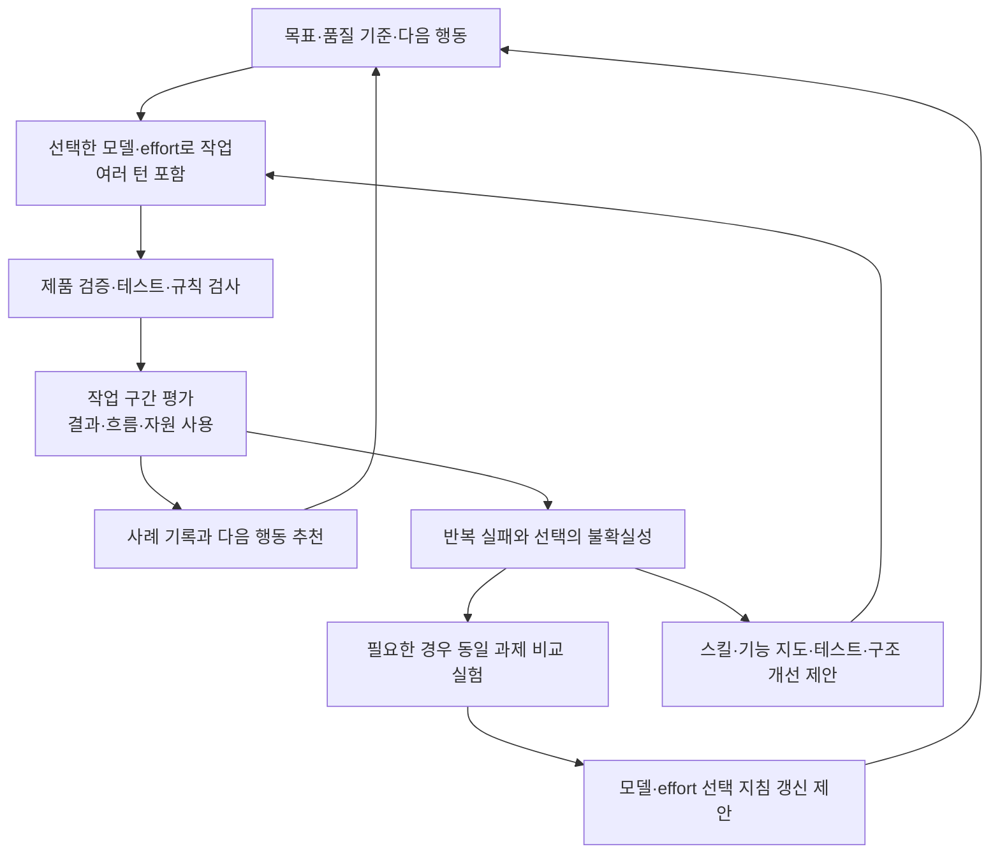

# 작업 품질·효율 평가와 모델·effort 선택을 위한 스킬 발전 기획

작성일: 2026-09-29. 상태: 분석 및 설계 제안. 스킬·에이전트 구현, 비교 실험, 제품 수정은 수행하지 않았다.

이 문서는 사용자가 설명한 최초 목적을 기준으로 기존 `review-completed-turn`의 발전 방향을 제안한다. Lauren Tan 관련 내용은 [사용자 지정 문서](/Users/donnieyu/DevSource/Personal/v-team-builder/docs/LAUREN_TAN_AGENT_ENGINEERING_SYSTEM_2026-09-29.md)를 해석해 적용한 것이다. 원영상과 스크린샷을 이번에 다시 검증한 보고서는 아니다.

## 1. 목적의 재정의

**하나의 목적을 수행한 작업 구간의 결과물·수행 과정·자원 사용을 평가하고, 누적 근거로 다음 작업에 적합한 모델·effort·작업 방법을 제안하며, 그 추천의 실제 성과를 후속 기록으로 검증한다.**

사용자가 원하는 것은 품질과 효율을 함께 개선하는 것이다. 따라서 여러 턴의 코드 검수는 필요한 기반이지만 그것만으로 목적이 완성되지는 않는다. 작업 기록을 선택 기준의 개선으로 연결해야 한다.

기본 운영 원칙은 품질을 우선하는 것으로 제안한다. 필수 요구사항과 품질 기준을 충족하지 못한 실행은 토큰이 적어도 좋은 선택으로 평가하지 않는다. 기준을 충족한 후보 사이에서도 유지보수성·완성도 차이를 남기고, 추가 품질에 필요한 시간과 자원을 비교한다. 품질과 효율이 서로 다른 후보에 유리하면 하나의 임의 종합점수로 숨기지 않는다.

‘최상의 코드’는 프로젝트의 요구사항·위험·관례·관찰 범위에 따라 정의해야 한다. 모든 작업에 통하는 절대 최적 모델이나 무결한 코드를 보장하는 체계로 만들지 않는다.

## 2. 현재 구조와 앞선 확장안이 제공하는 것

| 구조 | 달성 가능한 결과 | 아직 부족한 부분 |
|---|---|---|
| 현재 단일 턴 리뷰 | 해당 턴의 의도 적합성, 증거 확인, 중요 문제, 다음 작업 추천, 실행량 기록 | 여러 턴에 걸친 목표 달성·재작업 총량·모델 효과 비교 |
| 앞서 제안한 작업 구간 리뷰 | 누적 산출물 검수, 요구 변경 추적, 이전 문제의 해결·재발 확인 | 유형별 비교 기준, 과정 효율 평가, 추천의 성과 누적, 통제된 비교 |
| 이번 제안의 작업 평가 | 품질·흐름·자원 사용·추천 결과를 연결한 사례 축적과 선택 정책 개선 | 모델의 인과적 효과는 별도의 비교 실험과 반복 관측 필요 |

현재 [스킬](/Users/donnieyu/.codex/skills/review-completed-turn/SKILL.md), [에이전트](/Users/donnieyu/.codex/agents/completed_turn_reviewer.toml), [기록 형식](/Users/donnieyu/.codex/skills/review-completed-turn/references/record-format.md)은 증거와 추론 구분, 실제 설정 확인, 추천을 가설로 취급하는 원칙을 제공한다. 이 원칙은 유지한다.

## 3. 사용 목적과 실행 시점

적합한 사용은 기능 구현·버그 수정·리팩터링·설계 탐색처럼 결과와 완료 조건을 설명할 수 있는 작업 구간의 평가다. 설계 탐색은 의사결정 근거와 불확실성 해소로, 구현은 동작·구조·검증으로 평가한다. 서로 다른 단계를 같은 기준으로 순위화하지 않는다.

실행 시점은 기능 완료, 중요한 단계 전환, 반복 재작업 발생, 또는 사용자의 명시적 요청을 기본으로 한다. 매 응답 뒤에 전체 평가를 붙이지 않는다. 다음 행동이 짧은 확인이면 기존 추천을 유지할 수 있고, 원인 분석에서 구현으로 바뀌는 것처럼 작업 성격이 달라지면 다시 판단한다.

다음 세 동작을 구분하되 처음부터 별도 상시 에이전트 조직을 만들 필요는 없다.

| 동작 | 입력과 결과 | 호출 조건 |
|---|---|---|
| 실무 평가 | 작업 구간 → 품질·과정·사용량·다음 행동 추천 | 기본 동작 |
| 누적 분석 | 비교 가능한 평가 기록 → 유형별 선택 지침·실험 후보 | 반복 사례나 추천 변경 근거가 생겼을 때 |
| 비교 실험 | 같은 시작 조건과 과제 → 모델·effort 등의 차이에 대한 근거 | 선택이 불확실하고 앞으로 반복될 작업에 한정 |

작업 평가만 요청했는데 비교 실험까지 자동 실행하지 않는다. 비교 실험은 별도 목적·범위·예산이 있는 실행이다. 이번 기획에서는 실행하지 않았다.

## 4. Lauren Tan 문서에서의 적용 위치

| 문서 위치 | 이 스킬에 적용할 내용 | 사용자 목적에 맞는 조정 |
|---|---|---|
| §3.2 제품 직접 검증 | UI·통합 테스트·트레이스 등 실제 동작 근거를 품질 평가에 사용 | 리뷰어의 코드 독해만으로 기능 성공을 인정하지 않음 |
| §3.3 기능 지도 | 기능 접근 경로와 기대 동작을 제공 | 기능 지도 유무·버전도 기록해 탐색 비용과 모델 효과를 구분 |
| §4.1 관찰된 실패에서 스킬 개선 | 도구 호출과 작업 과정에서 반복 실패를 분류 | 결과 오류뿐 아니라 근거 없는 추측·불필요한 재탐색·검증 누락을 기록 |
| §4.2 Coordinator·실험 실행자·Judge | 동일 과제를 여러 조건에서 실행하고 독립 평가 | 상시 제품 개발 조직이 아닌 선택적인 비교 실험 절차로 사용 |
| §4.3 검증 스킬 자체 평가 | 평가자와 평가 기준의 정확성도 시험 | 알려진 결함·정상 사례로 오탐·누락을 확인하고 사람 판단과 보정 |
| §5 반복 지적을 검사로 이동 | 되풀이되는 결함을 테스트·lint·CI 개선 후보로 제안 | 같은 문제를 높은 모델이 매번 다시 찾는 비용을 줄임 |
| §6 표준 경로·상태 소유권·의존성 경계 | 구조적 문제의 원인과 개선 후보를 식별 | 프로젝트에 채택된 규칙을 기준으로 평가; Dune 규칙을 자동 이식하지 않음 |
| §7 검증·평가·규칙 검사 구분 | 각 증거가 답하는 질문을 분리 | 빌드 통과, 실제 동작 확인, 코드 품질, 모델 비교를 별도 판정 |
| §9 토큰과 기반 구축 투자 | 일회성 구축 비용과 이후 반복 작업 비용을 분리 | 제한 없는 반복 대신 예산·종료 조건·재사용 가능성을 명시 |

이 스킬의 위치는 문서의 작업 순환에서 나온 근거를 스킬 개선 순환과 구조 개선 순환으로 넘기는 지점이다. 제품 검증·CI·아키텍처를 대신하는 위치가 아니다.

## 5. 평가 단위: 목표, 구간, 턴을 함께 보존

성과의 기본 단위는 목적과 완료 조건을 가진 작업 구간이다. 턴은 세부 실행량과 행동을 관찰하는 단위다. 리뷰 호출 간격이 작업 경계의 기본 후보이지만, 여러 목적이 섞이면 나누고 하나의 목적이 여러 리뷰에 걸치면 연결한다.

리뷰 시작 전에 대상 턴 목록, 목표·변경 지시, 코드 및 산출물 상태를 고정한다. 이전 리뷰의 호출 시간만으로 검토 완료를 추정하지 않고 실제 검토 범위와 미검토 공백을 사용한다. 단일 턴 지정도 지원한다.

검수 완료, 요구사항 충족, 사용자의 수용, 장기 회귀 확인은 각각 다른 상태다. 사용자 응답이 없으면 수용 여부는 미확인이다. 중단된 실행도 변경과 자원 사용이 남았다면 기록하되 완료 성과로 세지 않는다. 실패·포기한 시도를 제외해 성공한 실행만 비교하는 오류를 피한다.

원래 요구가 바뀌면 범위 변경과 오류 수정을 구분한다. 합리적인 설계 탐색과 사용자 선택을 위한 왕복은 자동으로 낭비나 모델 실패가 되지 않는다.

## 6. 무엇을 어떻게 측정할 것인가

| 축 | 기록과 판정 | 피해야 할 대리 지표 |
|---|---|---|
| 목적 적합성 | 합의한 요구사항별 충족·미충족·미확인, 범위 이탈 | 최종 답변의 자신감 |
| 기능 품질 | 핵심·경계·실패 시나리오의 관찰 결과, 재발·후속 결함 | 빌드나 테스트 개수만으로 성공 선언 |
| 구조적 품질 | 상태 소유권·의존성·변경 국소성·중복·이해 가능성의 구체적 근거 | 코드 줄 수·파일 수·리뷰어 취향 |
| 작업 흐름 | 조사·설계·구현·검증·재작업의 경로와 결정 근거 | 턴 수·도구 호출 수만으로 비효율 판정 |
| 실행 자원 | 입력·캐시 입력·출력·추론 출력·실행 시간, 실제 설정 | 원시 토큰을 계정 크레딧으로 환산 |
| 사람 개입 | 오류 교정, 요구 변경, 선택, 권한 대응을 분리; 실제 투입 시간은 관측될 때만 | 사용자 메시지 수를 작업 실패나 노동 시간으로 환산 |
| 평가 절차의 비용 | 평가·기록·추가 확인에 쓴 실행량과 의사결정에 준 가치 | 검수가 발견한 문제 개수만으로 효용 평가 |

초기에는 근거 없는 100점제 대신 항목별 판정과 근거를 사용한다. 정량 점수가 필요해지면 판정 예시와 사람의 기준으로 먼저 보정하고 정의를 버전 관리한다.

실행 비용은 최초 시도만이 아니라 같은 목표를 달성하기 위한 실패·재시도·수정·검증을 포함한다. 리뷰 비용과 실험·스킬 구축 비용도 별도 표시한다. 중복 집계가 해소된 경우에만 합산한다. 캐시 입력과 추론 출력은 각각 입력과 출력의 하위 집합이므로 다시 더하지 않는다.

모델별 토큰 수는 실제 청구액이나 계정 한도의 동등한 단위가 아니다. 비용을 비교하려면 해당 실행에 적용되는 유효한 계측·환산 근거가 필요하다. 없으면 사용량과 시간을 분리해 보고한다. 경과 시간에는 대기·병렬 실행 중첩이 있으므로 에이전트 시간의 합과 구분한다.

비교 가능한 같은 과제 묶음에서는 품질 기준 충족 비율과, 실패를 포함한 총자원/수용된 작업 수를 함께 볼 수 있다. 수용된 작업이 0이면 단위 비용은 계산하지 않는다. 서로 다른 난도의 작업을 섞어 평균값으로 모델 순위를 만들지 않는다. 표본 수·누락·실패·분포를 함께 표시한다.

불필요한 파일 재독해나 반복 도구 실패는 원시 로그로 관찰할 수 있다. 하지만 로그에 토큰 귀속 정보가 없으면 그 행동 때문에 낭비된 토큰의 정확한 수치는 추정하지 않는다.

## 7. 모델·effort가 얼마나 중요했는지 판단하는 방법

실무 기록은 특정 조건에서 어떤 결과가 나왔는지를 알려준다. 같은 작업을 다른 조건으로 했을 결과는 알려주지 않는다. 따라서 모델 효과의 확신을 다음과 같이 구분한다.

| 근거 수준 | 말할 수 있는 것 | 말할 수 없는 것 |
|---|---|---|
| 단일 실무 관찰 | 이 조건에서 이 품질·사용량·재작업이 관찰됨 | 다른 모델보다 우수함 |
| 유사 사례 축적 | 이 유형과 환경에서 반복되는 경향이 있음 | 모델만이 그 차이를 만들었음 |
| 동일 과제의 조건 비교 | 고정한 조건과 시험 과제에서 선택의 차이가 관찰됨 | 모든 프로젝트에 같은 차이가 적용됨 |
| 별도 과제·후속 실무 확인 | 추천의 적용 범위 안에서 근거가 보강됨 | 영구적인 최적 설정임 |

모델·effort와 함께 과제 유형, 사전에 판단한 복잡성·불확실성, 코드 기준점, 요구 변경, 문맥 구성, 사용한 스킬·도구·검증 수단과 버전, 실제 권한을 기록한다. 실패한 뒤에만 ‘어려운 과제’로 분류하면 모델 비교가 왜곡되므로 사전 분류와 사후 수정 이력을 나눈다.

원인 분류는 모델·추론 부족, 문맥 부족, 요구 불명확, 도구·환경 문제, 스킬 누락, 구조 문제를 후보로 삼되 하나로 억지 확정하지 않는다. 근거·경쟁 설명·미확인 사항을 남긴다. effort 설정은 관측 가능한 실행 조건이며 숨겨진 사고의 질을 직접 측정한 값이 아니다.

### 선택적인 비교 실험

1. 앞으로 반복될 과제 중 선택이 불확실한 문제를 고르고 기대 품질과 예산·중단 기준을 먼저 정한다.
2. 동일한 시작 코드·요구사항·제공 문맥·도구·스킬·검증 환경으로 각각 격리된 실행을 준비한다. 작업자에게 과거 정답이나 최종 수정 내용을 노출하지 않는다.
3. 우선 같은 모델의 두 effort를 비교하거나, 같은 지원 effort 수준에서 두 모델을 비교한다. 모델과 effort의 상호작용이 의문이면 작은 2×2 비교로 확장한다. 같은 effort 이름이 모델 간 동일한 계산량을 뜻하지는 않는다.
4. 환경 오류와 실행 순서 영향을 기록한다. 표본과 예산에 맞춰 반복해 변동성을 확인하며, 한 번의 승패로 일반 순위를 정하지 않는다.
5. 검수자에게 모델명·effort·비용·기존 추천을 숨긴 산출물과 공통 기준을 먼저 제공한다. 동작 검사와 품질 판단 이후 자원 사용을 결합한다. 비교 결과 제시 순서도 바꿔 확인한다.
6. 판정이 엇갈리거나 선택 지침을 바꾸는 사례는 다른 모델의 Judge 또는 사람 판단으로 교차 확인한다. 모델 간 동의가 정답을 보장하지는 않는다.
7. 개선에 사용하지 않은 별도 과제와 후속 실무에서 확인한다. 스킬을 고칠 때마다 같은 문제만 반복해 만점이 되는 것을 일반 성능 향상으로 인정하지 않는다.

OpenAI 공식 평가 지침도 과제별 기준, 사람 판단과의 보정, 쌍별 비교·통과 판정, 평가자의 순서·장황함 편향을 다룬다. 여기서는 이런 평가 원칙을 참고하며 특정 평가 서비스나 API 도입을 전제로 하지 않는다. [Evaluation best practices](https://developers.openai.com/api/docs/guides/evaluation-best-practices)

## 8. 추천의 형태와 누적 선택 지침

모델 순위표 대신 조건이 붙은 선택 지침을 만든다. 예를 들어 ‘재현 경로와 수정 위치가 확인되고 통합 테스트가 있는 작은 버그 수정’과 ‘원인이 불명확한 여러 상태 소유자의 상호작용 문제’는 구분한다. 같은 코드베이스라도 조사·설계·구현·최종 검증 단계의 추천은 다를 수 있다.

추천은 다음 정보를 갖춘다.

- 다음 한 턴에서 수행할 구체적인 행동과 그 행동이 속한 전체 목표.
- 선택 가능한 모델·지원 effort와 실제 선택 여부.
- 근거 사례 ID, 비교 가능성, 근거 수준, 남은 불확실성.
- 제공할 문맥·사용할 스킬·필요한 검증 수단.
- 완료 조건과 재평가 조건: 예를 들어 원인 미확인 지속, 상태 소유권 충돌, 범위 확대.
- 후속 실행 구간의 결과·사용량·재작업과 추천 대비 차이.

추천과 다른 설정으로 수행했다면 이를 실패한 추천의 검증 결과로 세지 않는다. 사용자가 선택한 이유와 실제 설정을 기록한다. 추천된 작업이 여러 턴으로 늘어나면 모두 연결하고 추가 턴의 이유를 구분한다.

최소 기록 묶음은 다음과 같다. 이는 필드 설계 초안이며 아직 구현된 스키마가 아니다.

| 묶음 | 핵심 내용 |
|---|---|
| `work_unit` | 목표·단계·턴 목록·범위 변화·시작/최종 산출물·검토 공백 |
| `conditions` | 과제 분류·문맥·실제 모델/effort·스킬/도구/환경/권한 버전 |
| `assessment` | 목적·기능·구조 품질, 문제 ID, 증거, 관찰/추론/미확인 |
| `process` | 수행 단계, 재작업·탐색·요구 변경, 병목 가설과 대안 설명 |
| `usage` | 턴·역할별 수치, 출처, 완전성, 중복 여부, 별도 평가 비용 |
| `recommendation` | 다음 행동·모델/effort·근거·완료/재평가 조건·가설 상태 |
| `follow_up` | 실제 실행·설정·수용 여부·후속 결함·재작업 |
| `comparison` | 관련 실험·동일 조건 여부·표본·한계·적용 범위 |

개별 기록에서 재생성할 수 있는 가벼운 색인을 두고 관련 사례만 읽는다. 매 리뷰마다 모든 과거 로그를 다시 넣지 않는다. 최초 평가를 보존하고 후속 관찰을 추가하며, 선택 지침은 버전·근거·마지막 확인 날짜를 가진다. 모델·스킬·도구·코드 구조가 바뀌면 과거 추천의 적용 여부를 재확인한다.

이 기록은 로컬 평가 산출물이다. Codex 모델 자체의 학습이나 영구 메모리 자동 갱신을 뜻하지 않는다.

## 9. 평가 비용과 평가자 품질도 관리

현재 [다섯 번째 시험 분석](/Users/donnieyu/.codex/review-runs/20260924T011606Z-mobile-allocation-height/pilot-analysis.md)은 검수 과정 약 5분 9초와 반복 지적 세 건을 기록하고 있다. 이는 과거 보고서의 관측이며 이번에 당시 실행 로그를 다시 계측하지 않았다. 새 결함 발견이 없더라도 독립 확인은 가치가 있을 수 있지만, 같은 평가를 매 턴 수행할 근거가 되지는 않는다.

첫 버전은 진행 담당과 독립 평가자 한 명으로 시작한다. 수치 추출·형식 검사는 스크립트가 맡고, 평가자는 판단에 필요한 근거를 읽는다. 별도 Judge는 비교 실험, 판정 불일치, 중요한 선택 지침 변경 때 사용한다. 검수자의 모델도 비용과 판정 신뢰도를 측정할 대상이다.

평가자 자체에 대한 시험에는 알려진 결함, 정상 코드, 이미 수정된 결함, 의도적으로 범위를 제외한 변경, 실제 검증이 없는 성공 주장을 포함한다. 결함 탐지뿐 아니라 오탐·누락·근거 없는 원인 귀속·잘못된 턴 범위 선택을 확인한다.

평가·실험은 실행 전 예산과 종료 조건을 갖춘다. 근거가 늘지 않는 반복, 환경 불일치, 예산 도달이면 불확실성을 남기고 종료한다. ‘10점이 될 때까지’나 자동 모델 상향을 기본 반복 조건으로 쓰지 않는다.

## 10. 단계별 발전 제안

| 단계 | 만드는 결과 | 다음 단계로 넘어갈 근거 |
|---|---|---|
| 1. 평가 기준과 기록 정비 | 구간 단위 스킬, 품질·흐름·사용량 분리, 다음 행동 추천과 후속 연결 | 실제 사례에서 범위·근거·실행량을 빠뜨리지 않고 기록 |
| 2. 사례 축적과 분류 보정 | 작업 유형별 사례 목록, 반복 병목, 잠정 선택 지침 | 비교 가능한 사례와 반복될 선택 문제가 확인됨 |
| 3. 작은 조건 비교 | 같은 과제의 모델 또는 effort 비교, 평가자 보정 | 별도 과제와 후속 실무에서도 적용 가능한 차이가 관찰됨 |
| 4. 조건별 추천 개선 | 근거가 연결된 선택 지침, 단계별 모델·effort·문맥/검증 추천 | 품질 유지·향상과 전체 자원 사용 개선이 함께 관찰됨 |
| 5. 반복 실패의 기반 개선 | 기능 지도·스킬·회귀 테스트·lint·구조 개선 제안과 평가 | 개선 비용과 이후 재발·재작업 감소를 별도로 확인 |

첫 파일럿 후보는 범위가 명확한 버그 수정, 상태 상호작용을 추적해야 하는 버그 수정, UI 설계·검증 작업이다. 이는 대표 유형을 분리하기 위한 제안이며 특정 작업의 실행 승인이나 성능 결과가 아니다. 기존 완료 사례는 기록 형식과 평가 기준을 다듬는 데 먼저 쓰고, 비교 조건이 불충분하면 모델 순위 근거로 사용하지 않는다.

기존 단일 턴 스킬은 원래 의미와 기록을 보존한다. 새 스킬은 가칭 `evaluate-work`로 두고 기본 동작을 실무 평가로 한정하는 방안을 권한다. 비교 실험은 별도 절차로 명시하며 필요성이 검증되면 별도 스킬로 분리할 수 있다.

## 11. 첫 버전의 성공 기준

- 사용자가 선택한 목표를 한 턴 또는 여러 턴의 정확한 구간으로 설명할 수 있다.
- 코드·산출물의 품질 문제와 작업 과정의 비효율을 근거로 구분한다.
- 요구 변경·환경 문제를 모델 성능 저하로 오인하지 않는다.
- 실패와 재작업을 포함한 자원 사용을 가능한 범위에서 기록하고 누락을 표시한다.
- 다음 행동에 쓸 모델·effort와 검증 방법을 제안하며 근거 수준을 명시한다.
- 후속 결과가 원래 추천과 연결되어 추천의 적합성을 나중에 평가할 수 있다.
- 기존 문제와 반복 지적을 추적하면서 평가 자체의 중복 작업을 줄인다.
- 비교 근거가 없을 때 우열·절감률·모델 영향도를 꾸며내지 않는다.

이 기준을 먼저 충족한 뒤 ‘어느 설정이 얼마나 더 효율적인가’를 시험하는 것이 구현 우선순위다. 이번 문서의 결과는 그 발전 방향과 측정 설계이며 특정 모델의 우월성이나 토큰 절감 효과를 입증한 결과는 아니다.
