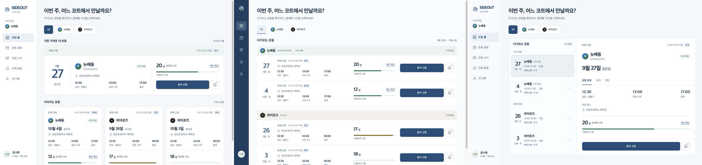
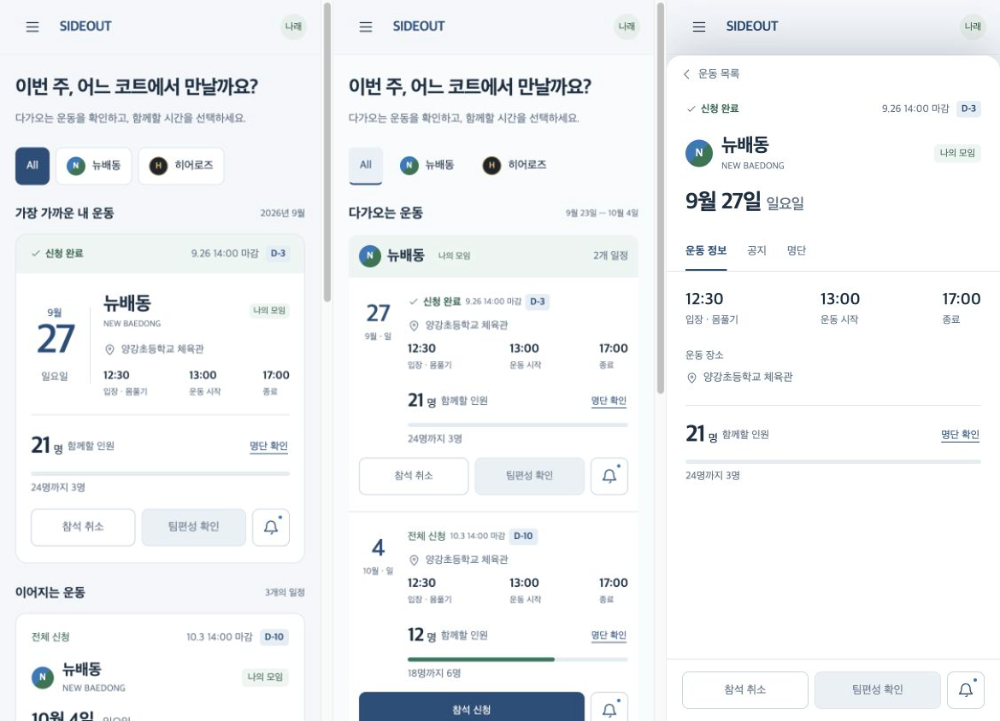

> 후속 갱신: 사용자의 주말 5모임 설명에 따른 새 비교안은 [주말 운동 구조 비교](ideation-2026-09-23/weekend/README.md)와 [실행 목업](http://localhost:4173/weekend/)을 참고한다. 아래는 앞선 1차 탐색 기록이며, 현재 추천을 자동으로 이어 적용하지 않는다.

# SIDEOUT 디자인 발전안 — 선택 대기

2026-09-23. DESIGN_IDEATION_BRIEF.md에 따라 구현·품질 검사보다 구성 탐색을 우선했다.

산출물: [비교 목업](ideation-2026-09-23/index.html), [설계 노트](ideation-2026-09-23/README.md).
로컬 미리보기: http://localhost:4173/

A 내 운동 중심, B 일정 비교 중심, C 목록과 상세 연결의 새 발전안을 같은 모임·회차·인원·상태로 비교한다. 데스크톱/모바일, 신청 전/후/공개 후를 비교 페이지에서 전환할 수 있다. 날짜·장소·인원·프로필 공개 범위와 역할 정책은 그대로 두었다.

추천은 A의 첫 회차 강조 + B의 후속 회차 목록 + C의 모바일 상세 시트. 단일 안 선택과 조합 모두 가능하다. 운영 화면 확장 아이디어는 설명만 제공했으며 이번 목업 구현 대상은 회원 홈이다.

실제 web/ 코드는 변경하지 않았고 배포하지 않았다. 기존 수정 사항과 QA 결과는 그대로 유효하다. 디자인 선택 후 실제 기능 연결과 상세 디자인·기능 검증을 진행한다. 데모 버튼은 샘플 상태만 바꾸며 서버에 저장하지 않는다. 외부 조사·출처를 사용하지 않은 자체 제안이다.

비교 이미지(왼쪽부터 A/B/C):

로컬 서버는 사용자의 목업 검토를 위해 유지한다. 자세한 검사·점수표·실제 로그인 개발은 이번 탐색 완료 조건이 아니다.
