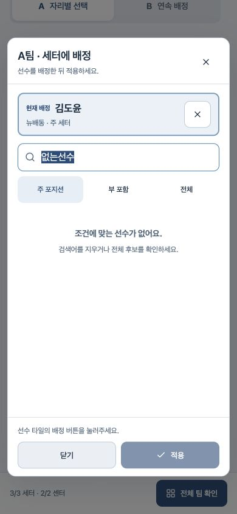
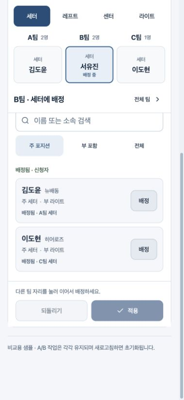

# 모바일 팀편성 A/B — 체험 안내와 제작 결과

현재 B안의 최신 목업은 [포지션별·자율·자동 배치 v3](MOBILE_ALLOCATION_MODES_V3.md)이다. 아래는 A/B 최초 비교와 이전 단계의 기록이다.

2026-09-23 · 비교 목업 v1 · 방향 선택 전

**최신 변경:** 사용자가 B의 순환식 연속 배정을 승인하여 [B안 v2](MOBILE_ALLOCATION_CONTINUOUS_V2.md)를 구현했다. B는 즉시 배정·다음 빈자리 순환·타일 X 확인창을 사용한다. 아래 매번 적용/되돌리기·전환 보호 설명과 화면은 v1 기록이다. A안은 그대로 유지된다.

## 바로 체험하기

- [A안: 자리별 선택](http://localhost:4173/weekend/allocation-ab/?variant=a)
- [B안: 팀 요약과 연속 배정](http://localhost:4173/weekend/allocation-ab/?variant=b)

한 화면 안의 A/B 버튼으로 전환할 수 있다. 전환 시 각 안의 배정은 독립적으로 유지된다. 새로고침·새 탭 접속은 초기 상태로 시작한다. `처음부터`는 확인 후 현재 안만 초기화한다. 로컬 컴퓨터의 서버가 켜져 있어야 하며 이 localhost 링크는 다른 휴대폰에서 직접 접속하는 배포 주소가 아니다.

1. 빈 A·B·C팀에 세터를 한 명씩 배정한다.
2. 센터 두 명을 원하는 자리에 배정한다.
3. `전체 확인`으로 세 팀의 행 보기를 확인한다. 코트 보기로 바꿀 수도 있다.
4. 다른 안으로 전환해 같은 과제를 해본다.

가상 신청자 18명과 3팀을 공유한다. 세터 3명은 김도윤·서유진·이도현이며, 센터는 오수빈·이서준·윤지호·임건우·조시우·최민준이다. 레프트·라이트도 수동 배정할 수 있지만 이번 비교의 핵심 과제는 5명 배정이다. 주/부 포지션은 가상 데이터다.

## 실제로 구현한 공통 동작

- 선수 타일 본문은 선택 버튼이 아니다. 타일의 `배정`으로 임시 변경하고 `적용`으로 편집 보드에 반영한다.
- 현재/임시 배정 선수는 위쪽에 강조하고 X로 해제한다. 해제도 적용 전에는 보드에 반영하지 않는다.
- A의 닫기·Escape, B의 되돌리기는 미적용 변경만 취소한다.
- 미배정 신청자를 먼저 표시하고, 배정된 선수에는 팀·자리를 표시한다.
- 다른 팀의 선수를 가져올 때 비워지는 자리와, 교체되어 미배정으로 돌아가는 선수 이름을 안내한다. 같은 선수를 중복 배정하지 않는다.
- 검색, 주 포지션·부 포함·전체 후보 범위, 검색 결과 없음 상태를 제공한다.
- 고정 전위 세터 자리와 한 개의 라이트 자리를 유지한다. 코트/행은 같은 배정 데이터를 사용한다.
- 두 안 모두 전체 확인은 행 보기로 열리고 코트로 전환할 수 있다. 다시 배정으로 돌아갈 수 있다.

기존 미결 Q-03에 대해서는 **체험용 보호 동작**을 적용했다. A는 미적용 변경이 있을 때 바깥 클릭으로 닫히지 않고, B는 적용·되돌리기 전 다른 대상/포지션/안으로 전환하지 않는다. 이는 비교안의 동작이며 운영 제품의 최종 정책을 승인받았다는 의미는 아니다. Q-04 후보 자격은 기존 모델을 유지했다. 센터/라이트 후보에 세터가 포함되는 기존 예외를 이번 제작에서 임의로 제거하지 않았다.

## 비교하면서 확인할 것

| 관점 | A: 자리별 선택 | B: 연속 배정 |
|---|---|---|
| 배정 대상 이해 | 코트에서 누른 자리를 선택창 제목으로 확인 | 강조된 팀·자리와 후보 위 제목으로 확인 |
| 다른 팀 비교 | 선택창을 닫고 보드를 봐야 함 | 같은 포지션의 세 팀 상태가 상단에 남음 |
| 반복 작업 | 자리마다 선택창 진입·종료 | 대상 자리를 바꾸며 후보 영역 재사용 |
| 전체 구성 확인 | 처음부터 전체 팀 보드, 모바일에서는 세로 스크롤 | 작업 중에는 같은 포지션 요약, 전체 확인으로 모든 포지션 조회 |
| 주의점 | 모바일에서 팀 간 스크롤과 선택창 왕복 | 첫 화면의 소개·요약이 후보 공간을 차지함. 두 자리인 센터/레프트는 요약 높이가 더 큼 |
| 헬퍼 재사용 가능성 | 생성 결과를 자리 단위로 수정 | 조건별 진행과 팀 비교·초안 검토에 활용 |

**현재 추천 가설:** 최초 다수 배정은 B, 전체 결과 확인은 공통 코트/행 보기를 사용하는 조합. 다만 B가 더 빠르다는 결론은 아직 내리지 않는다. 화면 왕복은 줄지만 대상 선택과 적용은 여전히 필요하다. 운영자가 직접 체험한 뒤 방향을 선택하고, 선택한 안으로 18~28명 전체 편성을 검증한다.

## 검증 근거

| 검사 | 결과 |
|---|---|
| 공통 A/B 상태 모델 | 31개 통과: 임시 변경 분리, 적용/취소, 이동·교체·해제, 중복 방지, 미적용 전환 보호, 초기화, 원본 불변성 |
| 재사용하는 기존 포지션 모델 | 52개 통과 |
| TypeScript·Vite 빌드 | `npm run build:allocation` 성공. Node의 module.register 폐기 예정 경고는 남아 있으나 빌드 오류 없음 |
| 실제 브라우저 조작 | A/B 각각 세터 3명→센터 2명→전체 확인 완료, 검색·해제 취소·되돌리기·이동 영향 안내·안별 상태 분리 확인 |
| 반응형 | Chromium 기반 인앱 브라우저의 320·360·390·430px 폭 및 1280px 데스크톱 확인. 검사한 화면에서 가로 넘침 없음 |
| 모바일 선택창 | 320px에서 선택창·하단 적용 버튼이 뷰포트 안에 위치. 열릴 때 제목에 포커스, 검색 자동 키보드 호출 방지, 닫은 뒤 원래 자리 버튼 복귀 확인 |
| 브라우저 로그 | 확인 시 오류·경고 없음 |
| 정적 디자인 검사 | 새 TSX/CSS 대상 Impeccable detector 결과 항목 없음 |

브라우저 도구로 조작한 결과이며, 실제 iOS/Android 터치·키보드·한 손 사용·스크린리더·큰 글꼴 확대 검증과 사용자 소요시간 측정은 하지 않았다. 뷰포트 검증을 실기기 검증으로 해석하지 않는다.

## 화면 기록

| A: 선택창 | B: 스크롤 중 팀 비교와 후보 |
|---|---|
|  |  |

[데스크톱 전체 팀 화면](shadcn-prototype/screenshots/mobile-ab-desktop-overview.png)

## 이번 범위 밖

초안 영구 저장·공개, 실제 로그인/계정 발급/서버 권한, 신청·대기 데이터 연결, 팀 수 변경·교대 자리 추가, 우선 보장 공개 검사, 규칙 기반 자동 배정·LLM은 이번 체험본에 연결하지 않았다. 기존 목업의 기능을 제거한 것이 아니라 별도 비교 경로의 제한이다. 운영용 `web/`과 기존 `position-slots`·`a-shadcn` 화면은 변경하지 않았다.

## 헬퍼와 연결되는 큰 흐름

`신청자 확인 → 팀 수·가용 포지션·조건 선택 → 규칙 기반 초안 → 전체 팀 비교 → 수동 조정 → 초안 저장 → 공개`

지금 만든 부분은 **팀 비교·수동 배정·변경 적용**이다. 이후 A를 선택하든 B를 선택하든 같은 배정/이동/해제 모델을 재사용한다. LLM은 후속으로 자연어를 조건과 변경안으로 해석하고, 권한·중복·우선 보장·공개 검사는 코드에 남긴다. 위 흐름은 연결 방향이며 헬퍼 구현 완료를 의미하지 않는다.

## 실행과 다음 결정

```sh
cd /Users/donnieyu/DevSource/Personal/v-team-builder/docs/design-review/shadcn-prototype
npm run check:allocation
npm run build:allocation
python3 -m http.server 4173 --bind 127.0.0.1 --directory /Users/donnieyu/DevSource/Personal/v-team-builder/docs/design-review/ideation-2026-09-23
```

서버가 이미 실행 중이면 마지막 명령은 다시 실행하지 않는다. 결과물 경로는 `ideation-2026-09-23/weekend/allocation-ab/`이다.

다음 사용자 결정은 **A/B 또는 구체적인 조합 선택**이다. 선택 전에는 운영 사이트에 적용하지 않는다. 선택 후 [단계별 작업·검토 보고서](TEAM_ALLOCATION_DELIVERY_PLAN.md)의 2단계로 진행한다.
