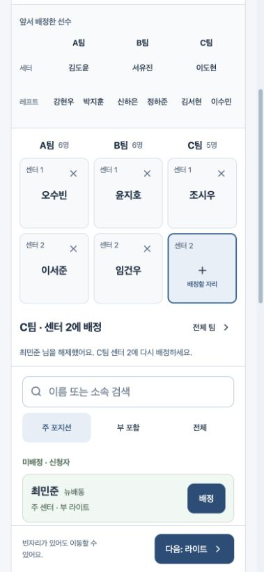

# B안 v2 — 순환식 연속 배정

후속 구현: [B안 v3 — 포지션별·자율·자동 배치와 모바일 하단 내비게이션](MOBILE_ALLOCATION_MODES_V3.md). 아래는 v2 시점의 기록이다.

2026-09-23 · 사용자 승인 방향의 검토 목업 · 운영 앱 미적용

[체험 화면 열기](http://localhost:4173/weekend/allocation-ab/?variant=b&review=cycle-v2)

## 확정한 흐름

- B에서 `배정`은 편집 중인 보드에 즉시 반영한다. 자리마다 `적용`을 누르지 않는다. 초안 저장·공개와는 별개의 의미다.
- 현재 포지션 안에서 팀 순서(A→B→C), 자리 순서(1→2)로 다음 빈자리를 찾는다. 현재 자리 이후부터 탐색하며 이미 배정된 자리는 건너뛴다.
- 끝에 도달하면 앞쪽으로 순환한다. 현재 포지션에 빈자리가 없으면 자동 이동을 멈춘다.
- 사용자가 직접 고른 자리부터 같은 규칙을 적용한다. C 레프트1에 배정하면 C 레프트2, 그 후 앞쪽의 다음 빈자리로 이동한다.
- 포지션 순서는 세터→레프트→센터→라이트다. 미완성이어도 탭이나 `다음: 포지션` 버튼으로 이동할 수 있다. 새 포지션에서는 A부터 첫 빈자리를 선택한다.
- 포지션을 모두 채워도 다음 포지션으로 자동 이동하지 않는다. 마지막 라이트 단계의 하단 버튼은 `전체 팀 확인`이다.
- 배정된 자리 타일의 X를 누르면 이름·팀·자리를 포함한 `취소 / 해제` 확인창이 열린다. 확정 후 그 자리가 새 배정 대상이 된다. 취소하면 기존 배정과 대상이 유지된다.

## 화면 구성

1. 포지션 탭.
2. **이전 포지션 요약:** 팀별 선수 이름을 간결하게 표시한다. 누르면 해당 포지션과 자리로 돌아간다. 건너뛴 빈자리는 `미배정`으로 표시한다.
3. **현재 포지션 자리:** 세 팀을 동시에 표시한다. 배정 대상은 파란 강조, 방금 배정한 자리는 연한 초록, 배정된 선수의 X는 해당 타일 안에 둔다.
4. 후보 검색·주/부 포지션 범위·선수 목록.
5. 다음 포지션 버튼.

이전 선수 요약은 페이지와 함께 스크롤되고 현재 포지션의 자리·배정 대상만 고정된다. 높이 600px 이하에서는 고정을 풀어 후보가 가려지지 않도록 한다. 이름 버튼과 X도 최소 44px 터치 영역을 확보한다.

검색 위의 별도 현재 선수 카드, 매번 적용/되돌리기 버튼은 B에서 제거했다. 검색으로 배정한 뒤 검색어는 비워 다음 선수를 바로 찾도록 하며 포지션 범위 선택은 같은 포지션 안에서 유지한다.

초기 전체 편성에서 기존 선수를 조용히 교체·이동시키지 않도록, 이미 사용한 후보는 배정된 위치를 표시하고 배정 버튼을 비활성화했다. 채워진 자리를 선택하면 X로 해제하거나 다른 빈자리를 선택하도록 안내한다. 선수 맞교환·직접 교체는 후속 수정 흐름에서 다룬다.

전체 확인은 같은 편성 데이터의 행/코트 보기다. A의 독립된 비교 목업은 보존하며, A의 선택창에는 기존 `배정 → 적용` 동작이 유지된다. 결과 이미지 출력은 아직 구현하지 않았다.

## 검증 결과

- 모델 검사 55개 통과: 기존 A안 31개 + 연속 배정 24개. 순환·차 있는 자리 건너뛰기·수동 대상 변경·포지션 완료 정지·해제 후 재배정·중복/덮어쓰기 방지·원본 불변성을 포함한다.
- TypeScript·Vite 빌드 성공. 기존 Node `module.register()` 폐기 예정 경고 외 빌드 오류 없음.
- 실제 인앱 브라우저에서 세터 3명→레프트 수동 점프와 순환→빈자리 유지 후 센터 이동→이전 선수 요약에서 복귀→나머지 자리 배정을 수행했다.
- 18명 배정 후 결과 화면에 A/B/C 각 6명, 총 18명 표시 확인.
- X 확인창 취소 시 선수 유지, 해제 확정 시 해당 자리 활성화 확인.
- 320px에서 가로 넘침 없음, 표시된 B 버튼의 너비·높이 모두 44px 이상. 390px 실제 배치와 1280px 세 팀 결과 배치 확인.
- 확인 시 브라우저 오류·경고 로그 없음.

실기기 iOS/Android 키보드·터치·스크린리더, 4팀/교대/대기자 및 저장·공개 연결은 이번 검증 범위 밖이다. 현재는 가상 신청자 18명·3팀의 메모리 목업이며 새로고침 시 초기화된다.

## 검토할 순서

1. 세터를 연속으로 배정하고 별도 적용 없이 다음 팀으로 넘어가는지 확인한다.
2. 레프트에서 A의 두 자리를 채운 뒤 C 레프트1을 선택해 배정하고, C 레프트2 이후 앞쪽 빈자리로 순환하는 흐름을 확인한다.
3. X의 취소와 해제를 각각 체험한다.
4. 빈자리를 남기고 다음 포지션으로 이동하고, 이전 이름 요약에서 다시 돌아간다.
5. 전체 확인에서 행/코트 결과를 비교한다.

다음 검토는 현재 자리 강조를 따라가기 쉬운지, 이전 요약과 후보 공간의 비율이 적절한지, 배정 직후 다음 후보 선택이 끊기지 않는지에 집중한다. 이 구현이 저장·공개를 포함한 최초 편성 전체 기능의 완성을 의미하지 않는다.

구현: `shadcn-prototype/src/continuous-allocation.tsx`, `allocation-ab-model.ts`, `allocation-ab.tsx`, `allocation-ab.css`. 실행: `npm run check:allocation`, `npm run build:allocation`.
