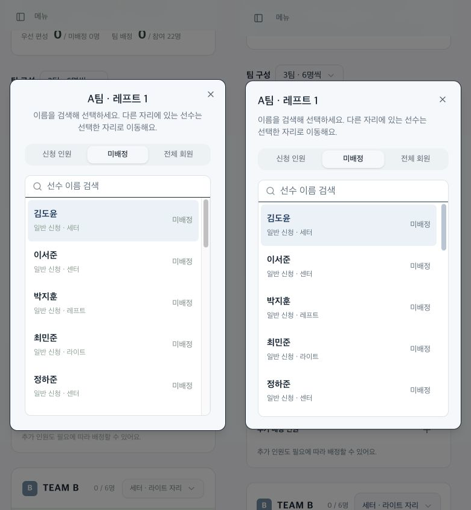
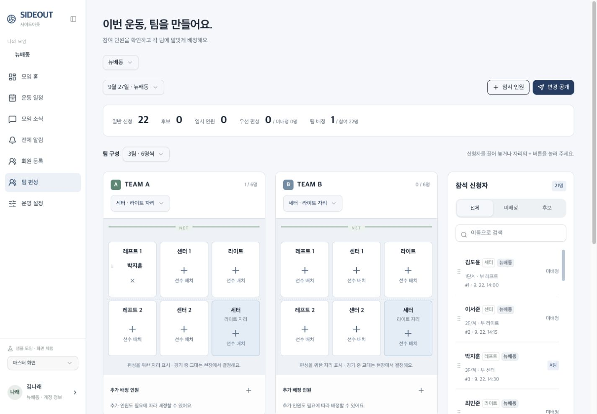

# SIDEOUT 디자인·사용성 QA

2026-09-23. 시작 커밋 bdf36ded5db2da1858484c85c97fea9143dd14cf와 문서 기준이 일치했다. 이후 UI 수정은 이 보고서와 web/PRODUCT.md, web/DESIGN.md를 기준으로 한다. C의 색감·제목·밀도와 B의 필터·세로 카드 구조를 유지했다.

## 방법과 데이터 경계

운영 사이트는 조회만 수행했다. 신청·취소·배정·공개는 localhost:5173 샘플에서만 수행했다. 독립 디자인/접근성 코드 리뷰 2건과 주 작업자의 실제 브라우저 측정을 결합했다. 전체 페이지 캡처 일부에 축소·이어붙이기 오류가 있어 최종 비교는 정상 확인한 뷰포트 캡처를 사용했다. 이미지 생성 목업이 아니다.

## 우선 문제와 처리

| ID | 근거 / 영향 | 수정 및 확인 |
|---|---|---|
| P1-01 여백 충돌 | 기존 app/globals.css:12 패널 248px, court-app.tsx:53 spacer 208px. 1440px에서 본문 시작 x248이 패널 끝과 같아 여백 소실. 좁은 데스크톱은 일부 가림. | Provider 단일 폭 사용. 수정 후 패널/spacer 208px 일치. 1440px 제목 x248(40px 여백), 1024px x232(24px 여백). |
| P1-02 모달 포커스 | 명단 닫기 후 activeElement BODY. enrollment.tsx:30, team-board.tsx:38에 Trigger 없는 controlled Dialog. | components/ui/dialog.tsx:60–80에서 호출 버튼 복귀. 선수 선택으로 +가 사라지면 stable slot 복귀. 명단/공지/Escape/키보드 배정 후 실측 통과. 모바일 메뉴도 원래 메뉴 버튼 복귀. |
| P2-03 운영 가독성과 일관성 | 신청 시각·부 포지션 #91a195/white 약 2.71:1, 미배정 #a0ada4 약 2.33:1. 홈과 다른 연녹색 UI. | globals.css:40–70 회청색 토큰 통일. 보조 텍스트 #607080/white 약 5.09:1. 팀 구분색·코트 구조 보존. |
| P2-04 모바일 조작 영역 | 기존 모달 Close 실측 약 16×16px. 배정 해제 및 교대 추가도 작은 아이콘 영역. | dialog.tsx:92 닫기 44×44, 한국어 이름. globals.css:34–37,61 주요 조작 44px. 360px 신청 후 3버튼 97/112/44px 폭, 높이44px, 가로 넘침 없음. 390px 선수 배정 후 해제 버튼44×44 실측. |
| P2-05 내비게이션·짧은 화면 | 접힌 메뉴 AX에 이름 없는 버튼 5개. 범용 모달 높이 제약 없음. | court-app.tsx:85 aria-label/aria-current, 본문 바로가기. dialog 전역 최대높이·스크롤. 667×375 공개 모달 top12/bottom363/height351, 내용 scroll845로 화면 안 스크롤 확인. |

## 실제 확인한 흐름

- 데스크톱 1440px 및 1024px: 홈, 펼침/접힘 메뉴, 코트와 신청자 도크, 사이드바 간격. 1024px 문서폭1009px으로 수평 넘침 없음.
- 모바일 390px/360px: 홈 단일 카드, 한글 제목/시간/버튼, 공지/명단/선수 선택 모달. 360px 문서폭345px, 390px375px(스크롤바 제외)로 수평 넘침 없음.
- 신청 전 21명 → 로컬 신청22명, 참석 취소와 비활성 팀편성 확인 → 취소21명 → 재신청22명.
- 뉴배동 소속 이름순 명단16명 확인. 히어로즈 카드에는 명단 확인 버튼 없음. 기존 우선 보장/API projection 규칙은 변경하지 않음.
- 공지 모달 Tab 순환·Escape 후 공지 버튼 복귀. 명단 모달도 원래 버튼 복귀. 모바일 메뉴 Escape 후 메뉴 버튼 복귀.
- 선수 검색 ‘박지훈’ → Enter로 A팀 레프트1 배정 → 원래 +가 사라져도 해당 포지션 영역에 포커스 유지.
- 로컬 마스터 팀 공개 → 회원 화면의 팀편성 확인 활성화 → 공개된 선수·회차 포지션·함께 참여 인원 확인. 운영 평가·신청 시각은 노출되지 않음.
- 667×375 가로 화면의 공개 모달 경계·내부 스크롤 확인.

## 검사

- TypeScript noEmit 통과.
- Sites Worker 빌드 통과. 기존 Node deprecation/route classification 안내만 발생.
- Impeccable detector: 변경된 TSX 4개, 결과 [] (위반0). CSS 대비는 별도 코드/화면 확인. detector는 한 번만 실행.
- git diff --check 통과.
- 기존 도메인 검사35개는 직전 통과 기록을 유지. lib/model.ts·operations·API·DB 및 모집/공개 정책은 이번에 변경하지 않아 전체 도메인 검사를 반복하지 않았다.
- 웹 접근성 검토 기준: https://raw.githubusercontent.com/vercel-labs/web-interface-guidelines/main/command.md (2026-09-23 조회). mutable browser injection은 사용하지 않았고 실제 DOM/AX/측정값으로 검증했다.

## 실제 화면

모바일 선수 선택: 왼쪽 변경 전, 오른쪽 변경 후. 동일 390×844 뷰포트. 헤더 정렬·텍스트 대비·닫기 영역 변경. 포커스 동작은 위 실측 기록 참조.

개선된 운영 화면(로컬에서 1명 배정·공개한 테스트 상태):

모바일 홈: 운영 사이트 변경 전 신청 전 상태와 로컬 변경 후 신청/공개 완료 상태. 데이터 상태가 달라 순수 배치 비교와 기능 확인을 구분한다.

[변경 전 홈](qa-2026-09-23/before-home-mobile-viewport.png) · [변경 후 홈](qa-2026-09-23/after-home-mobile-viewport.png)

## 미구현·미검증

실제 로그인·계정 자격 발급, 실제 회장/운영진 지정과 신규 모임 등록 흐름은 미구현. 무작위 배치·평가 투표·통계도 후속 범위다.

이번에 실제 iOS/Android 기기·가상 키보드·화면 읽기 프로그램·200% 글자 확대·긴 사용자 입력 극단값·드래그 제스처·전체 운영 설정은 검증하지 않았다. 입력16px/긴 문자열 줄바꿈/reduced-motion은 코드 보정이며 실기기 검증으로 표현하지 않는다. 자동30초 갱신의 장시간 포커스 유지도 별도 검증 대상이다.

추가 디자인 방향 질문은 생략했다. 사용자 승인 범위 내 수정이며 신규 기능·재선택이 필요하지 않았다. 임시 로컬 서버는 배포 완료 후 종료한다.

## 배포 결과

검증 소스 bfb15977027c71135d8b1d0311b8ca19d8c2a3a2를 기존 소유자 전용 비공개 사이트에 배포했다. 배포 성공: 2026-09-23 09:45 KST. 공개 범위 및 운영 데이터는 변경하지 않았다.
