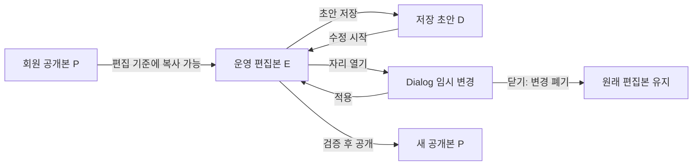

> 2026-09-26 최종 방향 확정 및 일정 상세 연결: [TEAM_ALLOCATION_FINAL.md](TEAM_ALLOCATION_FINAL.md)를 최신 기준으로 사용합니다.

# SIDEOUT 팀편성 기능 명세서

버전 0.3 · 2026-09-23 · **기획 검토본 / 모바일 최초 편성 우선 / 별도 A/B 일부 구현, 운영 앱 미적용**

[기획서](TEAM_ALLOCATION_PLAN.md)의 제품 규칙을 구현 가능한 단위로 정리한다. 확정 요구는 유지하되, 제안과 미결은 승인 전 코드에 반영하지 않는다. 이 문서는 운영 앱 구현 완료 보고서가 아니다.

2026-09-23 구현 상태 보충: [별도 모바일 A/B 체험본](MOBILE_ALLOCATION_AB_EXPERIENCE.md)에 배정 버튼/X/적용과 미적용 변경 보호를 구현했다. 아래 전체 저장·공개·권한 명세의 완료를 의미하지 않으며 기존 v8·운영 앱은 변경하지 않았다. B 구조는 체험 후 선택할 비교안이다.

더 최근 승인·구현: [B안 v2 순환식 연속 배정](MOBILE_ALLOCATION_CONTINUOUS_V2.md)은 배정 즉시 편집본 E를 변경하고 현재 자리 이후의 빈자리로 순환한다. 포지션 이동은 미완성/완성과 무관하게 수동이며 X는 확인 후 해제한다. 아래 Dialog의 임시 변경/적용 명세는 A에 해당한다. B에는 자리별 적용 단계가 없으며 D/P 저장·공개 구분은 유지한다.

## 0. 검증 우선순위 변경

최신 사용자 결정: 모바일에서 처음 전체 팀을 구성하는 과정이 우선이다. AC 시나리오는 유지하되 최초 배정/전체 검토/초안 저장을 먼저 검증한다. 한두 명 수정의 전용 화면 기획은 그 이후다. 최초 배정 중의 적용 취소·해제·오류 복구는 필수 기반이므로 미루지 않는다.

[모바일 A/B 검토안](MOBILE_ALLOCATION_AB_REVIEW.md)의 B안은 비모달 연속 배정의 제안이다. 선택되면 활성 팀/역할,미적용 변경 중 대상 전환,전체 팀 보기로의 복귀를 이 명세에 추가한다. 현재 코드나 확정된 Dialog 행동을 이미 변경한 것으로 해석하지 않는다. 헬퍼·LLM은 같은 배정 명령/검증/저장/공개 모델을 사용하도록 설계하는 방향을 제안한다.

## 1. 용어와 서로 독립적인 상태

| 용어 | 의미 | 바꾸지 않는 것 |
|---|---|---|
| 신청 상태 | 일반 신청 / 대기 접수 / 미신청 | 배정만으로 원래 신청 기록을 덮어쓰지 않음 |
| 회원 분류 | 정규 / 신입, 소속 모임 또는 무소속 | 예외 배정으로 신입을 자동 승급하지 않음 |
| 임시 인원 | 계정 없는 회차 한정 참가자 | 다른 모임 회원과 다름. 자동 회원 계정 생성 없음 |
| 프로필 포지션 | 운영자가 지정한 주/부 포지션 | 자리 변경으로 수정하지 않음 |
| 배정 역할 | 이번 회차의 세터/레프트/센터/라이트/교대 | 실제 경기별 로테이션·포지션 횟수와 동일하지 않음 |
| 후보 강조 선택 | 현행 목업에만 남은 타일 본문 UI 강조 | Q-02에서 제거 확정. 목표 명세에서는 상태 자체를 두지 않음 |
| 자리 임시 변경 | Dialog 안에서 정한 배정 또는 해제 | Dialog 확정 전에는 편집 보드에 영향 없음 |
| 편집본 E | 운영자가 현재 화면에서 수정 중인 전체 편성 | 저장본·공개본과 분리 |
| 저장 초안 D | 운영자가 명시적으로 저장한 전체 편성 | 회원에게 노출되지 않음 |
| 공개본 P | 공개 시점의 편성 복사본 | 초안 편집·저장으로 바뀌지 않음 |

한 회차의 같은 사람이 `대기 접수 + 초안 배정 + 공개본 미포함`일 수 있다. 이때 회원에게 편성을 공개하면 안 된다. `배정됨`은 현재 운영 편집본에서 이미 사용한 후보라는 의미이며 실제 출석이나 회원 공개 여부를 뜻하지 않는다.

## 2. 역할·범위·열람 조건

모든 운영 권한은 대상 회차의 모임 범위로 판단한다. 마스터는 전체, 회장은 해당 모임, 추가 운영진은 소속 및 마스터가 부여한 운영 범위다. 추가 운영 권한을 얻었다고 회장 전용 예외 권한까지 생기지 않는다.

| 기능 | 마스터 | 해당 모임 회장 | 해당 모임 추가 운영진 | 회원 |
|---|---|---|---|---|
| 편집·초안 저장·공개 | 가능 | 가능 | 가능 | 불가 |
| 신청자/대기자·내부 프로필 조회 | 가능 | 가능 | 운영 범위 안에서 가능 | 불가 |
| 미신청 회원 전체 검색·대리 편성 | 가능 | 가능 | 불가 | 불가 |
| 신입/임시 인원 정규팀 예외 배정 | 가능 | 가능 | 불가 | 불가 |
| 운영자 지정·권한 변경 | 가능 | 불가 | 불가 | 불가 |
| 공개 결과 조회 | 운영 목적 가능 | 운영 목적 가능 | 운영 목적 가능 | 아래 조건 |

회원 결과 열람: 공개본이 있고, 일반 신청자이거나 해당 공개본에 배정된 회원일 때 가능. 미배정 대기자·미신청자는 불가. 소속 신청 명단 확인은 별도 기능이며 팀 공개본 열람 권한으로 혼동하지 않는다. 과거 회차는 기존의 본인 참석 이력에 따른 조회 범위와 당시 공개 기록을 따른다.

현재 코드 한계: 통합 목업은 `canAddMembers={access.master}`로 마스터만 전체 회원 후보를 제공하며 회장 별도 체험은 없다. 포지션 비교 목업은 모두 가상 후보이고 권한 필터가 없다. 따라서 위 표는 제품 요구이며 목업이 모두 충족한 것은 아니다.

## 3. 저장 범위와 상태 전이

편집 시작 시 `E = D가 있으면 D, 없으면 P, 둘 다 없으면 빈 구성`의 독립 복사본을 만든다. Dialog는 `E`의 한 자리를 편집한다. 열 때의 배정을 `baseId`, 현재 변경 예정 선수를 `pendingId`로 둔다. `null`은 빈 자리다.

| 행동 | 상태 변화 | 취소/영향 범위 |
|---|---|---|
| 타일 배정 | `pendingId=선수 ID` | 회원/편집 보드/저장 초안/공개본 불변 |
| 현재 선수 X | `pendingId=null` | 같은 Dialog 안에서 임시 해제 |
| 원래 선수 다시 배정 | `pendingId=baseId` | 변경 없음으로 판단, Dialog 확정 비활성 |
| Dialog 확정 | E의 대상 자리 및 이동 원본 자리 원자적 변경 | D/P 불변 |
| Dialog 닫기 | pending 폐기 | E/D/P 불변 |
| 전체 취소 | E 폐기, D 또는 P 기준으로 복귀 | Dialog에서 이미 적용한 수정도 폐기 |
| 초안 저장 | 빈 교대 줄 정리 후 E를 D에 복사 | P 불변 |
| 공개/재공개 | 검증 후 E를 D와 새 P에 복사 | 회원은 새 P를 조회 |

Q-01 확정: Dialog는 `적용`; 최초 전체 편성은 `초안 저장`; 기존 초안 또는 공개된 편성을 `수정`한 경우는 `저장`이다. 두 전체 저장 모두 D만 갱신하며,회원 공개본을 바꾸려면 별도 `공개`가 필요하다. 현행 목업 표기는 아직 바꾸지 않았다. 위 표의 Dialog 확정은 `적용`을 의미한다.

닫기·Escape·바깥 클릭은 현행 목업에서 모두 미확정 변경을 폐기한다. Q-03은 실수 방지 동작 제안이며 아직 적용하지 않는다. 편집본 전체의 미저장 변경에 대한 페이지 이탈 보호는 통합 시 필요하다. Dialog가 열린 동안 전체 저장/공개는 실행하지 않는다.

## 4. 화면별 기능 요구

### TA-01 회차와 편집 진입

- 입력: 회차 ID, 로그인 회원 ID, 모임별 역할, 시작/종료·모집·공개 상태, 저장 초안.
- 일정 상세의 모임명/날짜 고정 헤더를 유지한다. 팀편성 제목 오른쪽의 수정으로 편집한다.
- 현행 통합 목업은 등록 완료·운동 시작 전·관리 권한 보유 시 편집 가능하다. 시작 후 수정 허용 확대는 이번 범위에서 하지 않는다.
- 정보 편집과 팀편성 편집의 저장 단위를 섞지 않으며 동시에 편집하지 않는다.

### TA-02 팀·코트·행

- 기본 자리: 전위 `레프트 / 센터 / 세터`, 후위 `레프트 / 센터 / 라이트`.
- 기본 추가 자리로 각 팀의 `라이트 2`를 둔다. 코트 보기에서는 여섯 기본 자리 밖의 별도 `추가 인원` 영역에 배치한다. 18명 편성에서도 빈 라이트 2 자리를 유지한다.
- 비어 있어도 여섯 기본 자리와 세터 위치를 유지한다. 선수 주 포지션을 보고 자리 종류를 바꾸지 않는다.
- 코트·행 보기 전환은 표현만 바꾸며 자리 ID·선수·교대·변경 여부 불변이다.
- 행 보기의 세터 자리는 최상단, 그 아래 레프트/센터/라이트 역할과 이름·소속. 큰 포지션 그룹과 그룹별 인원 집계 없음.
- 모든 팀을 표시한다. 데스크톱은 폭에 맞게 여러 열, 모바일은 세로 스택. 4팀일 때 읽기 어려운 고정4열을 강요하지 않는다.
- 현행 비교 목업은 A/B/C로 시작하고 D까지 추가한다. 실제 서비스의 초기 팀 수 선택은 통합 설계 대상이다. 빈 팀 삭제는 통합 목업에 있고 포지션 목업에는 없음.
- 이름 있는 팀 삭제는 자동으로 선수를 잃게 하지 않는다. 초기 범위에서는 빈 팀만 삭제하는 기존 규칙을 유지하는 안을 사용한다.

### TA-03 선수 Dialog와 현재 배정

- 제목은 클릭한 팀·자리 기준. 현재 배정 카드 → 검색 → 필터 → 후보 목록 → 영향 안내 → 하단 닫기/확정 순서.
- 현재 또는 임시 배정 선수는 상단 고정 카드에서만 한 번 표시한다. 검색어/필터에 의해 숨지 않는다.
- X는 Dialog 내부 임시 해제. 저장 전 보드에서 선수를 제거하지 않는다.
- 타일 배정 버튼은 후보별로 노출한다. 다른 팀 배정 후보도 선택 가능하되 이동 출발팀을 표시한다.
- Q-02 확정: 본문은 정보 영역이며 선택 강조/재클릭 토글을 제거한다. 배정 버튼으로만 pending을 변경하고 X로 해제한다. 현행 코드의 choice 상태와 선택됨 표시는 후속 구현에서 삭제한다.
- 변경이 없으면 확정 버튼은 비활성. 하단 닫기는 항상 사용 가능. 현재 선수의 X와 닫기는 서로 다른 기능이다.

### TA-04 후보 범위·필터·정렬

계산 순서는 **권한/회차 후보 집합 → 역할 조건 → 검색 → 미배정 필터 → 정렬**이다. `전체 후보`는 역할 필터 확장이며 `전체 회원` 권한을 부여하는 버튼이 아니다.

현행 역할 조건:

| 자리 | 주 포지션 필터 | 부 포지션 포함 | 전체 후보 |
|---|---|---|---|
| 세터 | 주 세터 | 주 세터 또는 부 세터 | 권한 내 모든 후보 |
| 센터 | 주 센터 또는 주 세터 | 앞 조건 또는 부 센터 | 동일 |
| 라이트 | 주 라이트 또는 주 세터 | 앞 조건 또는 부 라이트 | 동일 |
| 레프트 | 주 레프트 | 주 레프트 또는 부 레프트 | 동일 |
| 교대 | 모든 포지션 | 모든 포지션 | 동일 |

센터/라이트의 주 세터 포함 예외는 Q-04 검토 대상이다. 현재 주·부 포지션 값은 가상 샘플이며 실데이터 평가처럼 취급하지 않는다.

표시 그룹은 미배정 신청자 → 미배정 대기자 → 배정된 신청자 → 배정된 대기자. 각 그룹 안의 센터 후보는 주 센터 → 부 센터 → 그 외 세터 → 전체 후보의 나머지 순서다. 동일 우선순위의 실제 후보는 신청/대기 접수 순서를 안정적으로 유지한다. 현재 샘플은 회원 배열 순서이며 접수 시각이 없다. 예외 권한의 미신청 회원·신입·임시 인원은 별도 범위로 표시하고 정상 신청자 목록에 섞지 않는다.

검색은 이름·소속·프로필 포지션, 공백 검색은 전체 결과. 검색/필터 변경은 임시 배정을 초기화하지 않는다. 현재 배정 상단 카드는 유지된다. 미배정 강조는 색뿐 아니라 텍스트 배지를 함께 쓴다. 배정된 후보는 배정됨·팀·역할을 표시한다. 필터로 결과가 없을 때 현재 선수의 해제와 닫기는 계속 가능하다.

정렬은 추천 표시일 뿐이다. 미배정 대기자가 배정된 신청자보다 먼저 보이더라도 신청 우선권이나 보장 의무는 변하지 않는다. 후보 미배정 판정은 공개본이 아닌 현재 임시 편성 기준이다.

### TA-05 배정·교체·팀 간 이동

한 회차의 한 참가자는 동시에 한 자리만 차지한다. 같은 팀 내 자리 이동도 동일하다. 사람이름을 식별자로 사용하지 않는다.

| 상황 | Dialog 확정 결과 |
|---|---|
| 빈 자리에 미배정 선수 | 대상 자리 채움 |
| 찬 자리에 미배정 선수 | 기존 선수는 미배정, 새 선수로 교체 |
| 다른 자리의 선수 | 출발 자리 비움, 대상 자리 채움 |
| 찬 자리에 다른 자리의 선수 | 출발 자리 비움, 대상의 기존 선수는 미배정. 자동 맞교환 없음 |
| 현재 자리 해제 | 해당 자리 비움, 후보 풀에 유지 |

교체·이동으로 빠지는 이름과 출발팀은 확정 전에 확인 가능해야 한다. **현행 코드의 차이:** 다른 팀 이동 안내는 있으나 타일의 배정 버튼을 바로 누르면 기존 대상 선수의 이름을 포함한 교체 영향 안내가 일관되지 않다. 따라서 명세 충족으로 보지 않고 다음 UI 설계에서 보완한다.

권한 없는 후보, 다른 회차 참가자, 삭제된 자리, 중복·오래된 버전을 서버에서 재검증한다. 실패 시 이전 편성과 임시 입력을 유지하고 원인을 표시한다. 지금 포지션 목업의 `placeOnBoard`는 임의 ID를 검증하지 않는 샘플 함수이므로 서비스 API로 그대로 사용하지 않는다.

### TA-06 교대 자리

- 기본6자리 밖에 여러 줄 추가 가능. 실제로 동시에 뛰는 선수 수를 늘리는 의미가 아님.
- 각 줄은 고유 ID를 가지며 마지막 아래에 추가 버튼을 계속 표시한다.
- 빈 줄은 개별 삭제 가능. 배정된 줄은 먼저 선수 해제 후 정리하거나 전체 저장에서 빈 줄로 정리한다.
- Dialog 확정에서는 빈 교대 줄을 즉시 삭제하지 않는다. 전체 초안 저장에서 선수 없는 교대 줄만 제거한다.
- 기본 빈자리, 선택된 교대 선수, 함께 참여하는 인원은 삭제하지 않는다.
- 팀원 수는 실제 배정된 고유 참가자 수이며 빈 줄을 세지 않는다. 교대 순서/횟수를 자동 지정하지 않는다.
- 최신 복수 줄 요구를 `팀당 최대7명` 제한으로 되돌리지 않는다. 인원 적정성 안내는 Q-05에서 확정한다.

### TA-07 초안 저장·공개·재공개

초안 저장은 불완전한 배정을 허용한다. 회원에게는 미공개이며 저장 실패 시 성공 문구를 띄우지 않는다. 서버 연결 후 저장 성공 시점과 초안 버전을 갱신한다.

공개 필수 검증: 운영 권한과 회차 상태, 적법한 참가자, 중복 없음, 빈 팀 없음, 전체 인원0명 아님, **현재 신청자 전원 배정**, 신입/임시 인원 예외 권한. 대기자·미신청 회원은 전원 배정 조건에서 제외한다. 팀당6~7명 권장은 별도이며 모든 기본 자리와 추가 자리 충족을 자동 필수 조건으로 추가하지 않는다(Q-05).

실패 시 공개본은 불변이고 편집본은 유지한다. 문제 있는 팀/선수로 이동할 수 있게 한다. 공개 성공은 새 공개본과 이력을 만들며 재편집 중 회원은 이전 공개본을 본다. 재공개는 최신 검증을 다시 수행한다. 배정된 대기자의 열람 권한은 저장이 아닌 공개본 포함 여부로 판정한다.

현재 통합 목업은 UI와 명단 상태 명령 양쪽에서 신청자 전원 배정을 확인한다. 실제 서버 연동 때 권한과 버전 충돌 검증도 필요하다.

### TA-08 회원 결과와 경기 순서

- 편집 보드와 동일한 자리 데이터를 사용하되 공개본만 읽는다.
- 공개 배정 역할은 표시하되 프로필 주/부 포지션·실력·접수 시각·후보 필터·미배정 실명은 제외한다.
- 코트/행, 본인 표시, 소속, 총원, 교대 명단을 제공하는 구성안이다. 결과 화면은 아직 별도 목업에 미구현.
- 경기 순서는 `경기 번호 / 시작–종료 / A팀 vs B팀`으로 읽히게 한다. 팀편성을 수정한다고 대진을 임의로 재생성하지 않는다.
- 기존 대진이 삭제된 팀을 참조하면 공개 검토에 표시하는 방안을 제안한다. 대진 편집·자동 생성은 후속 범위다.
- 실제 출석 기록과 편성 결과를 분리하며 과거 공개 기록을 현재 프로필로 덮어쓰지 않는다.

### TA-09 모바일·키보드·상태 안내

- 공유 shadcn Button/Dialog/Input/Badge/Checkbox 사용. 역할과 버튼 규격을 화면마다 임의로 바꾸지 않는다.
- 타일 본문은 비대화형 정보,배정만 Button으로 구성한다. 버튼 안에 버튼을 넣지 않는다.
- +, 수정, X, 닫기, 확정은 최소44px 터치 영역을 목표로 검증한다.
- 초기 검색 포커스, Dialog 포커스 제한, 닫힌 뒤 원래 자리 버튼 복귀. 자리 삭제 시에는 해당 팀 제목 또는 추가 버튼으로 복귀.
- 짧은 화면과 가상 키보드 환경에서도 현재 선수·검색·후보·하단 행동에 접근 가능해야 한다. 목록과 Dialog 스크롤의 충돌을 검증한다.
- 저장/이동/해제 결과는 짧은 상태 알림. 반복되는 제품 규칙 설명을 카드에 추가하지 않는다.

## 5. 필요한 데이터와 명령 경계 — 구현 제안

DB 스키마/API URL을 확정한 것이 아니다. 기능을 분리하기 위한 최소 모델이다.

| 데이터 | 필요한 필드/관계 |
|---|---|
| Session | ID, clubId, 운동 시각, 모집 마감, 우선 기간, 상태 |
| Participant | 회차 참가자 ID, memberId 또는 임시 인원 ID, 표시 이름·소속, 정규/신입/임시 분류 |
| Application | participantId, 일반/대기 상태, 접수 순서·시각, 우선 보장 기록 |
| PositionProfile | memberId, 주/부 포지션, 평가. 운영 권한에만 반환 |
| LineupDraft | sessionId, version, 팀/자리/참가자, 함께 참여하는 인원, 저장 시각/저장자 |
| LineupPublication | 공개본 ID/version, 공개자·시각, 당시 이름/소속/배정 복사본 |
| Slot | 안정적인 slotId, teamId, 역할, 코트/교대 구분, participantId 또는 null |
| Match | 순서, 시작/종료, 팀 참조. 라인업과 연결하되 독립 관리 |

명령 경계: `후보 조회`(권한 적용), `자리 변경 계산`(순수 함수), `초안 저장`(버전 검사), `공개 검증`, `공개`(원자적 갱신), `공개 결과 조회`(최소 정보만 반환). 서버가 반환하지 않아야 할 개인정보를 브라우저에서 숨기는 것으로 대체하지 않는다. 동일 참가자 중복 방지와 다른 팀 이동은 한 저장 단위로 처리한다.

## 6. 인수 시나리오

아래는 앞으로 구현을 검증할 기준이다. 이전 검사 개수로 통과 판정하지 않는다.

| ID | 입력/행동 | 기대 결과 |
|---|---|---|
| AC-01 | 빈 팀 생성 | 코트 세터1·라이트1·센터2·레프트2와 코트 밖 추가 라이트1, 팀 인원0 |
| AC-02 | 코트↔행 전환 | 같은 선수/자리/교대 유지, 세터 표시 규칙 유지 |
| AC-03 | 이미 배정된 자리 수정 | 현재 선수 상단1회, 검색 결과와 중복 없음 |
| AC-04 | 검색/필터로 현재 선수가 조건에서 제외 | 상단 현재 선수와 해제 버튼 유지 |
| AC-05 | 빈 센터 자리, 모든 후보 | 미배정이 배정됨보다 먼저, 그룹 안 센터 우선 |
| AC-06 | 미배정 대기자와 배정된 신청자 존재 | 미배정 대기자가 먼저 보이나 우선 보장 규칙 불변 |
| AC-07 | 새 후보 타일 배정 후 닫기 | 편집본·저장본·공개본 모두 불변 |
| AC-08 | 새 후보 타일 배정 후 Dialog 확정 | 편집본만 변경, 전체 초안은 아직 미저장 |
| AC-09 | 현재 선수 X 후 닫기/확정 | 닫기는 복원, 확정은 편집본의 자리만 비움 |
| AC-10 | 원래 선수로 되돌림 | Dialog 변경 없음, 확정 비활성 |
| AC-11 | A에 있는 선수 B로 이동 | A에서 제거, B에1회. 취소하면 둘 다 그대로 |
| AC-12 | 이미 찬 B로 이동 | B의 기존 선수는 미배정, 자동 맞교환 없음, 사전 영향 확인 |
| AC-13 | 교대3줄 중1줄만 배정 후 전체 저장 | 빈2줄만 삭제, 기본6자리/배정된 교대1명 유지 |
| AC-14 | 저장 후 교대 줄 재추가 | ID 충돌/기존 선수 덮어쓰기 없음 |
| AC-15 | 전체 취소 | Dialog에서 확정한 변경도 저장 전 기준으로 복원 |
| AC-16 | 초안 저장 후 회원 조회 | 이전 공개본 유지 또는 미공개 상태 |
| AC-17 | 대기자를 초안에 배정→저장→공개 | 앞 두 단계 열람 불가, 공개 이후 열람 가능 |
| AC-18 | 우선 보장 회원 누락 공개 | 차단하고 해당 회원 표시, 기존 공개본 유지 |
| AC-19 | 추가 운영진이 미신청/신입 예외 배정 시도 | UI와 서버에서 권한 거부 |
| AC-20 | 타 모임 권한/회수된 권한으로 저장 | 거부, 다른 모임 데이터 변경 없음 |
| AC-21 | 다른 운영자가 먼저 저장 | 버전 충돌 안내, 무조건 덮어쓰기 없음 |
| AC-22 | 회원 결과/API 조회 | 내부 프로필/평가/접수순서/초안 데이터 없음 |
| AC-23 | 같은 이름 참가자 두 명 | 고유 ID로 구분, 잘못 이동·중복 제거하지 않음 |
| AC-24 |320px·가상 키보드·긴 이름/소속 | 가로 넘침 없이 검색/하단 버튼 접근, 초점 복귀 |
| AC-25 | 후보 없음·권한 없음·공개 전·과거 회차 | 각 상태에 맞는 빈 화면/읽기 전용, 정보 누출 없음 |
| AC-26 | 과거 참가자 프로필 변경 | 당시 공개본의 소속·이름·역할 기록 불변 |

추가 확정 인수 조건: 본문 클릭만으로 강조·임시 배정이 바뀌지 않아야 한다. Dialog 하단은 `적용`, 최초 전체 저장은 `초안 저장`, 기존 편성 수정 후에는 `저장`이어야 한다. Q-03 결정 후 바깥 클릭 인수 조건을 확정한다.

## 7. 현재 구현과 요구의 차이

| 요구 | 포지션 목업 | 통합 목업 | 다음 작업 |
|---|---|---|---|
| 코트/행·고정 세터·다팀 비교 | 있음 | 다른 행 편집 사용 | 동일 컴포넌트 연결 |
| Dialog 임시 적용/닫기 | 있음 | 클릭 즉시 편집본 배정 | 상태 모델 통일 |
| 빈 교대 정리·복수 교대 | 있음 | 슬롯 구조 없음 | 역할/자리 모델 연결 |
| 저장 초안/공개본 분리 | 없음 | 메모리 모델 있음 | 서버 저장 경계 설계 |
| 실시간 신청/대기/접수순서 | 가상21명·파생 부포지션 | 가상 샘플 | 회차 참가 데이터 연결 |
| 회장/추가 운영진의 예외 권한 | 없음 | 일부 예시만 있음 | 모임별 역할 검사 |
| 보장 대상 누락 공개 차단 | 없음 | 해당 검증 없음 | 운영 도메인 규칙 연결 |
| 신입/임시 인원·별도 참여 영역 | 없음 | 미연결 | 참가자 모델과 화면 추가 |
| 공개 결과의 새 코트 UI | 없음 | 기존 공개 명단/대진 예시 | 결과 화면 별도 검토 |
| 로그인·계정 발급·서버 보안 | 없음 | 없음 | 실제 운영 전 필수 |
| 자동 헬퍼/AI/투표 | 계획 | 계획 | 수동 화면 확정 후 |

검증 근거는 현재 코드 읽기와 이전 실행 기록이다. 이번 문서 작성에서 운영 사이트 QA나 새 기능 테스트를 수행하지 않았다. 실제 앱 `web/`의 기능을 모두 재감사한 결과로 해석하지 않는다.
