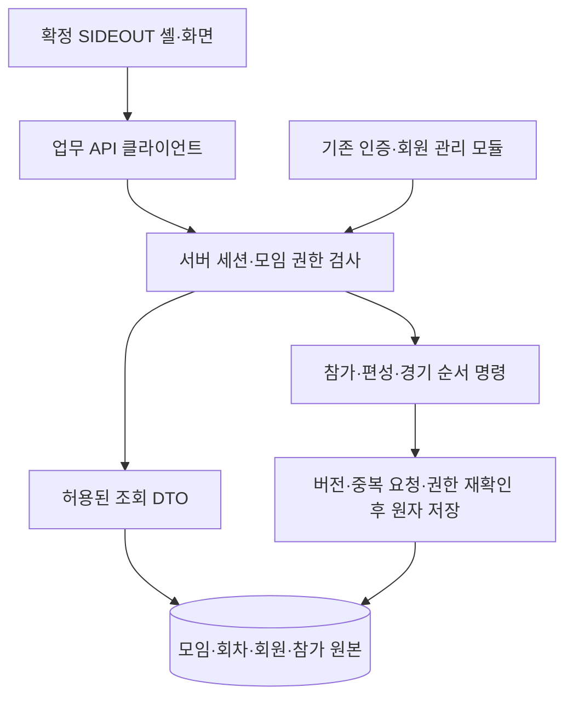

# SIDEOUT 목업 승격 기준과 통합 설계

상태: 2026-09-30 사용자 명세 검토 완료(‘확인했어’). 승인한 ‘확정 UI를 보존한 단계적 연결’ 방향을 문서화했다. [P1 구현 계획](../plans/2026-09-30-promotion-p1-read-path.md)을 작성했으며 제품 구현은 아직 시작하지 않았다.

## 1. 목표와 이번 산출물

사용자가 모바일에서 검토한 `a-shadcn` 화면을 실제 SIDEOUT의 기본 화면으로 이식한다. 로그인한 회원·운영자가 같은 서버 데이터를 조회하고 신청·편성·공개·경기 순서 변경을 수행하게 한다. 화면 재설계보다 이미 확정한 상호작용의 보존을 우선한다.

이번 산출물은 승격 기준, 원본 보존, 계약 제안, 단계별 인수 조건이다. 제품 코드 변경·인증 브랜치 병합·DB migration 적용·실회원 반입·계정 발급·메일 발송·배포는 수행하지 않는다. 문서의 새 계약은 구현 완료를 의미하지 않는다.

첫 구현 단위는 **합성 계정 로그인 → 최초 비밀번호 변경 → 모임 홈 → 일정 상세 조회**다. 쓰기 기능은 이후 단계로 분리한다. 회원 관리·신규 가입 전체를 이 첫 단위에 묶지 않는다.

## 2. 기준과 근거

| 근거 | 사용 범위와 한계 |
| --- | --- |
| 현재 대화의 최신 사용자 결정 | 제품 동작과 화면의 우선 기준. 오래된 기획서·목업 코드보다 우선 |
| [확정 UI 원본 보존](../../design-review/baselines/2026-09-30-approved-ui/README.md) | 미커밋·미추적 소스까지 포함한 복원용 아카이브와 파일별 해시. 모든 코드 동작의 제품 승인으로 해석하지 않음 |
| [기존 통합 계획](../../INTEGRATION_PLAN.md) | C01–C09, 서버 신원·조회 투영·저장 충돌 설계를 재사용. 과거 경로와 진행 상태는 아래 현황으로 보완 |
| [회원 SSOT](../../ACCESS_AND_DEPLOYMENT_SSOT.md) | 회원 정책 원본. 메인 복사본보다 인증 브랜치의 후속 문서가 앞서 있으므로 인수 시 커밋 기준 대조 |
| `feat/auth-rotation` 참조 커밋 `1563f39d1b7f773b1397b1510f6e69a87ef42a55` | M1~M3 및 후속 수정의 커밋된 구현 존재 확인. 현재 미커밋 M4 변경과 구분 |
| 사용자 모바일 확인 | 선택된 자리로 미리보기 스크롤, 상단 도구 가림 허용, 연결 동작 검증 완료. 모든 기기·모든 정책 예외까지 검증했다는 뜻은 아님 |

정본 저장소는 `/Users/donnieyu/DevSource/Personal/v-sideout`이다. 이전 `v-team-builder`와 다른 작업 트리는 읽기 근거일 뿐, 해당 변경을 무조건 복사하는 원본이 아니다. 현재 `main`의 시작점은 `a110043ec537a33ed0a7a966d238eabd73d53183`이다.

인증 작업 트리 `.worktrees/auth-rotation`에는 진행 중인 미커밋 변경이 있다. 인수 대상 커밋과 migration 묶음을 고정한 뒤 충돌·의존성을 검토한다. 작업 트리 전체 덮어쓰기나 진행 중 파일의 임의 인수는 하지 않는다. 기존 인증 담당/통합 담당의 소유 경계는 유지한다.

## 3. 승격 범위

### 3.1 보존할 화면·사용 흐름

| ID | 기준 |
| --- | --- |
| UI-01 | 모임 홈의 주 이동·즐겨찾기·모바일 사이드바를 보존. 내 정보는 사이드바에서 진입 |
| UI-02 | 일정 상세, 일정 정보 수정, 팀편성 수정, 경기 순서 수정은 구분된 자식 화면. 모임·날짜 맥락과 뒤로가기 제공 |
| UI-03 | 팀편성 수정은 코트 미리보기로 진입. 자리 선택 시 배정 화면으로 이동하고 미리보기 복귀 시 현재 선택 자리로 스크롤. 상단 도구가 화면 밖으로 나가는 것은 허용 |
| UI-04 | 포지션별 배정이 기본. 세터→레프트→센터→라이트, 현재 자리 이후 빈자리로 순환. 포지션 이동은 명시적 버튼·탭으로 수행 |
| UI-05 | 같은 팀 선수는 같은 열. 요약 배치판과 선수 풀 내부 스크롤, 고정 하단 내비게이션 유지. 이름 영역은 선택, X는 즉시 배정 해제 |
| UI-06 | 미배정 신청자는 포지션과 무관하게 모두 후보에 존재. 주포지션→부포지션→다른 포지션 순으로 구분. 대기자·미신청 회원은 별도 범위. 그룹별 숫자 표시 |
| UI-07 | 타일의 주포지션은 OH/OP/MB/S로 작게 표시. 코트의 배정 위치와 회원의 주포지션을 혼동하지 않음 |
| UI-08 | 코트의 전위는 레프트·센터·세터, 후위는 레프트·센터·라이트. 라이트 두 번째 자리는 코트 외 추가 인원 영역. 기본 라이트 빈자리 유지 |
| UI-09 | 팀 추가는 목록 맨 아래. 4팀이면 비활성. 빈 팀만 삭제 가능하고 마지막 팀은 삭제 불가. 삭제 후 실행 취소 유지 |
| UI-10 | 추가 선수 자리는 팀의 추가 인원 영역에서 생성·배정. 비어 있는 추가 자리는 삭제 가능. 저장 시 비어 있는 임의 추가 자리는 정리하되 기본 라이트 2 자리는 유지 |
| UI-11 | 저장 성공 후 편집 화면·선택 위치 유지. 공개 확인창은 ‘참석 회원에게 팀편성과 경기 순서 공개’로 안내. 공개 조건 미충족 시 저장만 가능 |
| UI-12 | 미저장 변경이 있으면 내부 이동·뒤로가기·로그아웃 등 이탈에서 보호. 로그인 만료·권한 회수 시에는 보안 경계를 우선하고 이전 사용자의 데이터를 다음 사용자에게 복원하지 않음 |

PC-01은 사용자가 하단 팀 추가 위치를 승인하여 복원 대상에서 제외했다. PC-02는 선택 자리 추적 및 도구 가림을 수용한 기록으로 종료했다. 최초 진입을 강제로 맨 위로 바꾸는 작업을 추가하지 않는다.

### 3.2 서비스에서도 보존할 상태 규칙

- 준비 저장 일정은 권한 없는 회원에게 노출하지 않는다. 미등록 카드는 관리 가능한 모임·날짜에만 생성한다.
- 마스터는 내 모임 없이 전체 모임을 관리한다. 운영자는 소속 기본 권한과 추가 부여 모임의 유효 권한으로 관리한다. 권한 합산은 인증 계층이 한 번만 수행한다.
- 신청·대기·취소와 편성 초안·공개본은 다른 상태다. 배정 해제는 참가 신청 취소가 아니다.
- 공개 이후 본인·운영자·마스터 모두 참가 취소 불가. 공개 후 새 참가 등록은 대기자가 된다.
- 미배정 숫자는 신청 상태인 회원 중 초안에 배정되지 않은 수다. 미신청 회원과 대기자는 이 수에 섞지 않는다.
- 모든 신청자가 배정되어야 공개 가능. 중복 선수, 잘못된 자리, 빈 팀 등 편성 유효성도 서버가 함께 검사한다.
- 대기자를 초안에 넣고 저장해도 공개 참석자로 승격시키지 않는다. 공개 시 참가 상태·공개본·최초 공개 시각을 함께 확정한다.
- 미신청 회원 배정에는 참석 의사 확인을 받는다. 저장 명령의 확인 대상 ID가 실제 미신청 대상과 일치해야 한다. 편집 취소로 참가 등록이 발생하면 안 된다.
- 재편집 초안 저장은 기존 공개 팀을 바꾸지 않는다. 다시 공개할 때만 공개본을 교체한다.
- 공개본 열람은 권한 있는 운영진, 해당 일정의 신청자 또는 공개 편성에 배정된 회원으로 제한한다. 미배정 대기자·미신청 회원에게 공개본을 반환하지 않는다.
- 일반 소속 회원에게는 같은 모임 신청자 명단과 허용된 게스트 수만 제공한다. 운영진은 해당 회차 신청자·대기자와 배정용 회원 후보를 조회한다.
- 경기 순서는 팀편성과 별도 수정 화면에서 취소·저장하며 별도 공개 버튼은 없다. 초안 편성에 맞춘 경기 순서는 운영진, 공개 팀에 맞춘 경기 순서는 해당 공개본 열람 가능자에게 제공한다.

### 3.3 보존하되 이번 첫 구현에서 제외할 범위

규칙 기반 자동 배치는 최종 승격 범위에 포함한다. 대화형 헬퍼·LLM·실력 투표·이미지 출력·자율 배치는 후속 기능이다. A/B 참고 화면·역할/상태 선택기·고정 샘플 시각은 운영 화면에서 제외하고 개발용 자료로 보존한다.

‘모임 공간’은 현재 목업에서 메뉴 위치만 검토했다. 기존 web의 게시판 기능은 삭제하지 않으며, 새 셸로 옮길 범위와 메뉴 노출은 별도 인수 항목으로 남긴다. 첫 내부 시험에서는 미완성 메뉴를 실제 기능처럼 제공하지 않는다. 신규 가입·승인·전달도 최종 출시 요구에서 제외하지 않고 M4 진행 작업과 별도로 합류한다.

## 4. 현재 구현 차이와 승격 차단 조건

| ID | 관찰된 차이 | 처리 방침 / 영향 단계 |
| --- | --- | --- |
| GAP-01 | `web/app/api/workspace/route.ts`가 URL role과 DEMO_MEMBER를 사용 | 서버 검증 신원으로 교체. 공개 접근 전 데모 API 우회 차단. P1 |
| GAP-02 | 목업의 고정 `REVIEW_NOW`, 2026년 9월 기준 주 이동, 이름 기반 선수 ID | 서버 시각·KST 날짜·불변 회원/모임/회차 ID로 변환. P1~P2 |
| GAP-03 | web 공개 조건은 보장 회원 중심, 목업은 모든 신청자. 기존 web 팀 수·세터 자리 규칙도 다름 | 최신 대화 규칙과 목업 명령을 기준으로 web 도메인 차이 표 작성 후 교체. 기존 동작을 무심코 합치지 않음. P2~P3 |
| GAP-04 | 목업 등록 폼에는 cap/priority가 있지만 `REGISTER_SELF`는 공개·마감만으로 대기 여부 결정 | 상한 도달 후 대기 전환이라는 기존 제품 요구를 서버에 구현. 마지막 정원 경쟁도 원자 검사. 우선기간 보장과 ‘모든 신청자 공개’ 관계는 P2 설계에서 명시; 화면 설정만 이식하고 적용됐다고 주장 금지 |
| GAP-05 | `generateMatchPlan(teamCount)`가 고정 A/B/C/D를 생성. 빈 B팀 삭제 후 A/C/D이면 실제 팀과 불일치 가능 | 실제 팀 ID·표시 순서로 생성/검증. 팀 구성 변경 시 대진 재생성 안내; 기존 공개 경기 순서는 유지. P3 |
| GAP-06 | 편집 보드는 1~4팀을 허용하지만 경기 생성은 3/4팀만 지원 | 1/2팀을 작성 중 초안으로 허용. 1/2팀 공개 허용 여부는 P3 시작 전 정책 확인 필요. 팀 수 제한을 임의로 기존 UI에 추가하지 않음 |
| GAP-07 | 목업 `RosterView`는 제한된 visibleRoster와 전체 applicants/waiters를 함께 보유 | 원본 객체 직렬화 금지. 서버 응답 DTO를 역할별로 명시. P1~P2 |
| GAP-08 | 인증의 모임 directory 제공자는 미연결 상태로 실패 처리 | 운영 모임 원본을 연결해 회원 관리 선택지와 업무 권한이 같은 ID 사용. P1 |
| GAP-09 | 주/부 포지션은 목업 프로필, 인증 브랜치에는 가입 포지션 후속 변경 진행 중 | 회원 프로필 담당과 저장 원본·필드 계약 고정. 인증 테이블에 중복 프로필을 임의 추가하지 않음. P2 이전 |
| GAP-10 | 취소된 회원을 직접 편성하면 현재 명령은 not_participant; 명단 추가를 거쳐야 함 | 기존 경로를 보존하고 취소 이력을 우회해 미신청 확인만으로 재등록하지 않음. 관련 사용자 정책 변경은 별도 판단. P2 |

이 항목은 이번 UI 수용을 취소하는 목록이 아니다. 샘플 화면을 실제 데이터에 연결할 때 필요한 계약·누락 검사다. 표의 추론은 이번 턴 브라우저 재현 결과가 아니다.

## 5. 구조와 책임

선택한 방식은 UI와 명령 모델의 단계적 이식이다. 전체 목업 복사는 샘플 권한·고정 시각을 함께 가져오며, 전면 재작성은 이미 검증된 인증/편성 작업을 잃으므로 채택하지 않는다.

| 대상 | 제안 위치/책임 |
| --- | --- |
| 앱 셸·화면 | `web/components/sideout/`에 홈·상세·편집 화면 분리. `web/app/`이 진입·라우트를 소유. 공통 shadcn 버튼과 토큰은 기존 web 컴포넌트와 대조해 한 구현 사용 |
| 편성 UI | `SessionAllocation`, `ContinuousAllocation`의 동작과 스타일을 이식. 네트워크 저장은 콜백/클라이언트 경계로 분리 |
| 참가 규칙 | `web/lib/roster/`의 순수 명령·조회 모델. 현재 roster-state 회귀 사례를 이식하되 server context 주입 |
| 저장·인증 | `web/lib/server/` 어댑터 제안. 인증 모듈의 `resolveVerifiedIdentity`를 소비. 제한 세션은 업무 접근 불가 |
| 프로필·모임 원본 | 인증/회원 담당의 프로필 계약과 통합 담당의 모임 directory를 연결. 표시 이름·소속은 ID 조회 결과 사용 |
| 데이터 변경 | migration은 단일 담당이 작성. auth 진행 migration 번호를 확인하고 기존 migration 수정 없이 새 변경 추가 |

기존 `main.tsx`를 그대로 한 파일로 복사하지 않는다. 홈/상세/편집 화면과 상태 어댑터를 분리하되, 승격과 무관한 전역 리팩터링은 하지 않는다. 목업과 운영 앱에 두 개의 서로 다른 참가 규칙을 영구 유지하지 않는다. 목업은 보존본, 운영 앱은 승격 후 수정 정본이 된다.

## 6. 데이터·API 계약 제안

### 6.1 저장 원본

- 회원: 불변 memberId, 표시 이름·소속·활성 상태·주/부 포지션. 권한과 비밀번호는 기존 인증 원본 담당.
- 모임: 불변 clubId, 이름·약칭·기본 요일·입장/시작/종료·장소. 샘플 ID 자동 채택 금지; 시험 데이터는 명시적 합성 ID를 사용.
- 회차: 불변 sessionId, clubId, 날짜·시간·신청 설정·공지·등록 상태·버전. `clubId + localDate` 유일성은 현행 ‘같은 모임 같은 날짜 한 회차’ 규칙에 맞춰 저장소가 보장.
- 참가/편성 집계: 회차별 participants, draftLineup, publishedLineup, draftMatchPlan, publishedMatchPlan, firstPublishedAt, revision. 선수는 이름 객체 대신 memberId 참조로 저장; 역사 표시가 필요하면 별도 명시적 스냅샷 필드를 사용.
- 즐겨찾기: 사용자별 clubId 집합. URL의 필터·주 정보와 계정의 즐겨찾기 저장은 구분.
- 명령 처리 기록: actorId + sessionId + commandId, 요청 내용 해시, 처리 결과 버전. 같은 명령 재시도가 중복 변경을 만들지 않도록 참가 변경과 함께 저장.

정규화 테이블과 회차 JSON 집계 중 **초기에는 회차별 집계 + CAS를 제안**한다. 기존 전 모임 workspace JSON과는 분리하여 회차 충돌 범위를 줄인다. 정확한 테이블/SQL과 보관 정책은 해당 단계 구현 계획에서 정하고 D1 시험으로 입증한다. 집계 JSON 사용만으로 원자성·권한 경합이 해결되었다고 보지 않는다.

### 6.2 읽기 계약

| 제안 경로 | 반환 범위 |
| --- | --- |
| `GET /api/auth/session` | 기존 C01 유지: anonymous / password_change_required / active의 최소 회원 정보 |
| `GET /api/clubs` | 홈·회원 관리가 공유하는 허용 모임 ID와 표시·기본 일정 정보 |
| `GET /api/sessions?weekStart=YYYY-MM-DD&filter=...` | 서버 기준 주·정렬·허용 일정·카드 인원·본인 상태. 준비 일정/미등록 가능 자리의 관리 권한 반영 |
| `GET /api/sessions/:id` | 일정 정보 + 허용된 명단/팀/경기 순서 + revision + capabilities |
| `GET /api/sessions/:id/candidates` | 대상 모임 편성 권한을 검사한 후 배정 가능한 회원의 최소 프로필·참가 상태. 일반 회원은 거부 |
| `GET /api/me/preferences` | 본인의 즐겨찾기 |

`capabilities`는 화면 표시용 `canEditSchedule/canManageRoster/canEditTeams/canEditMatches/canPublish/canCancelSelf` 등 허용 여부다. 서버는 쓰기 요청 때 다시 계산하므로 클라이언트 값을 신뢰하지 않는다. 권한 원본 grants를 브라우저에 전달할 필요는 없다. 마스터 회원 관리 메뉴도 서버 산출 기능 허용 값으로 표시한다.

미허용 이름·초안·대기자·주/부 포지션은 응답에 넣지 않는다. 공개 배정 위치와 내부 프로필 포지션은 구분한다. 조회 전체에 no-store를 적용하고 사용자 변경 시 클라이언트 캐시를 비운다. 비공개 회차의 존재 노출을 피하도록 비허용/미존재 상세 응답은 일관되게 처리한다.

### 6.3 쓰기 계약과 실패

`POST /api/sessions/:id/commands`는 `{commandId, expectedRevision, type, payload}`를 받는다. 참가 명령은 REGISTER_SELF, ADD_MEMBERS, CANCEL_PARTICIPATION, SAVE_DRAFT, PUBLISH_TEAMS, SAVE_MATCH_ORDER를 기준으로 한다. 일정 등록/수정과 즐겨찾기는 별도 자원의 버전과 요청으로 처리한다.

- actorId, access, now, 회원 프로필은 서버가 생성한다. 선수 참조의 이름·소속·권한을 요청 본문으로 덮어쓸 수 없다.
- lineup은 teamId/title, slotId, assignedPosition, memberId를 명시한다. 프로필 mainPosition과 assignedPosition은 다른 필드다. 문자열·숫자·배열 길이·중복·알 수 없는 명령·없는 팀/자리를 HTTP 경계에서 검증한다.
- 401/최초 변경 필요: 업무 화면 접근 해제. 403/권한 회수: 편집 제출 차단. 409/버전 충돌: 입력 유지 후 최신 데이터와 비교; 자동 덮어쓰기·자동 공개 금지. 400/422: 입력 오류. 503/연결 실패: 성공으로 표시하지 않고 편집 유지.
- 공개는 신청자 상태·공개본·경기 순서·최초 공개 시각·revision을 같은 커밋으로 변경한다. 취소는 참가 상태·초안에서 제거를 같은 커밋으로 처리한다. 저장 직전 현재 권한과 authorizationVersion도 검사한다.
- 동일 commandId와 같은 payload의 응답 유실 재시도는 같은 결과를 반환한다. 다른 payload 재사용은 거부한다. 재시도에도 최신 권한을 검사하며 과거 비공개 응답을 무조건 재생하지 않는다.
- 저장 성공 시 받은 revision과 저장된 baseline으로 dirty를 갱신한다. 선택 자리·편집 화면은 유지. 저장 중 추가 편집을 허용한다면 응답 이후의 변경을 지우지 않는다; 최초 구현은 저장 중 중복 제출을 막고 그 동작을 명시한다.
- 경기 순서의 일반 경기는 실제 팀 ID로 생성한다. 기본값은 현행 목업의 3팀 3라운드(라운드 사이 신입 경기), 4팀 1라운드(신입 경기 앞뒤), 경기당 20분, 신입 2팀이며 2~4팀 선택·끄기·드래그 정렬을 유지한다. 존재하지 않는 팀과 중복 경기 ID를 거부하고 종료 시각 초과를 안내한다. 일반 경기의 라운드별 대진 보존도 검사한다.

## 7. 첫 구현 단위 P1의 구체적 경계

**입력:** 보존된 UI, 커밋으로 고정한 인증 M1~M3 계약, 로컬 합성 계정과 모임·회차 데이터. 실제 회원 자료는 사용하지 않는다.

**산출물:** 인증 gate와 확정 앱 셸, 운영 모임 directory, 권한 검사된 홈·상세 읽기 API, 서버 데이터에 연결된 조회 화면. 첫 비밀번호 변경을 마친 사용자만 접근하며 두 계정의 화면이 같은 원본을 반영한다.

**라우팅 제안:** `/home`, `/session/:id`, `/account`를 정식 URL로 사용하고 주·필터를 query에 보존한다. 편집 URL은 후속 단계에서 추가. 기존 `#/...` 링크는 승인된 경로만 파싱해 replace 이동하는 호환 어댑터로 처리한다. session ID를 날짜 형식 정규식에 종속시키지 않는다. SSR 중 window/location 접근을 하지 않으며, 직접 URL 진입은 서버 조회로 복원한다.

**접근 흐름:** anonymous→로그인, restricted→최초 변경, active→안전한 내부 복귀 URL. 외부 URL redirect 금지. 로그인 실패·저장소 장애·일정 없음·허용 일정 없음은 서로 구분한다. 로그인한 사용자의 서버 capability로 메뉴를 결정한다.

P1 시험 화면에서는 아직 연결되지 않은 신청·등록·편성 수정 버튼을 성공하는 것처럼 두지 않는다. 내부 시험 단계의 읽기 범위를 분명히 표시하고, P2/P3 완료 후 정상 UI로 연결한다. 완성된 목업은 별도 검토 URL에서 계속 확인할 수 있다.

**P1 완료 조건:** 실제 로컬 인증 API+DB로 로그인/첫 변경/로그아웃, 정상·제한·만료·권한 없는 계정 접근, 준비 일정 숨김, 직접 URL/새로고침/뒤로·앞으로, 320/390px 및 사용자 iPhone 검토, 역할 query 조작 거부, 응답에서 비공개 필드 없음. 이 단계는 가입 승인·참가 쓰기·편성 저장 완료로 보고하지 않는다.

## 8. 단계별 인수 조건

| 단계 | 산출물 | 통과 조건 |
| --- | --- | --- |
| P0 현재 | 보존본·설계·차이 표 | 소스 복원 해시 일치, 설계 자체 검토, 사용자 문서 검토 |
| P1 | 인증→홈→상세 조회 | 위 7절. 완료된 인증 커밋 인수와 실제 club directory 연결 포함 |
| P2 | 일정 등록/수정·신청/대기/취소·운영진 명단·즐겨찾기·프로필 연결 | 두 사용자 같은 명단, 서버 시각/상한/권한, 저장 실패 상태 불변, 회차 생성 중복 거부 |
| P3 | 팀편성·자동 배치·공개·경기 순서 | UI-03~UI-12, 모든 신청자 공개 조건, 미신청 확인, 대기 승격, 기존 공개본 보존, 실제 팀 ID 대진 |
| P4 | 통합 회귀·운영 준비 | 동시 저장/취소·공개 경쟁/권한 회수/응답 유실, 실제 모바일, 신규 가입 작업 합류 상태, 백업·복구 절차 |
| P5 | 제한 운영 | 시험 계정 검증 후 운영 환경·회원 반입·배포 범위를 확정하여 실행. 공개 URL만 존재하는 상태를 서비스 완성으로 보지 않음 |

별도 인증 작업의 M4(가입 신청·승인·전달)는 P1의 선행조건이 아니다. 그러나 일반 신규 가입까지 제공하는 출시에서는 완료 또는 명시적인 출시 범위 결정이 필요하다. 알림 메일·신입 분류·회원 생성 권한의 진행 중 설계를 여기서 덮어쓰지 않는다.

## 9. 검증 행렬

| ID | 입력/행동 | 기대 결과 |
| --- | --- | --- |
| V01 | 일반 회원이 URL/body에 master·타인 ID 주입 | 서버 신원 불변, 권한 없는 변경 거절 |
| V02 | 운영자가 소속/추가 권한 모임과 타 모임 조회·수정 | 허용된 모임만 관리. 마스터는 소속 없이 관리 |
| V03 | 제한·만료·비활성·권한 회수 세션으로 API 직접 호출 | 업무 접근 거절. 첫 변경 건너뛰기 불가 |
| V04 | 같은 이름의 두 회원, 회원 표시 이름 변경 | memberId별 신청·배정 이력 유지 |
| V05 | 마지막 일반 신청 자리 동시 신청 | 상한을 초과한 신청자 생성 없이 한 순서로 확정; 이후 대기 |
| V06 | 본인 취소·운영자 취소와 최초 공개 경쟁 | 먼저 확정된 상태 기준. 공개 후 취소 불가, 참가/편성 부분 변경 없음 |
| V07 | 신청자 누락/빈 팀/중복 선수 공개 | 거절, 기존 초안·공개본 보존 |
| V08 | 대기자 배정→저장→공개 | 저장까지 대기, 공개 때 승격/열람 허용 |
| V09 | 미신청 배정 확인 취소/확인 후 편집 취소/저장 | 앞 두 경우 참가 원본 불변, 저장 때 검증 후 등록 |
| V10 | 두 운영자 같은 revision 저장, 응답 유실 재시도 | 하나만 새 변경, 충돌 입력 유지, 중복 명령 재실행 없음 |
| V11 | 편성 저장 후 계속 수정·취소 | 마지막 성공 저장이 baseline. 이후 변경만 폐기 |
| V12 | 팀 B 삭제·D 추가·되돌리기, 경기 생성 | 표시 순서·선택 복원 및 실제 존재 팀만 대진 생성 |
| V13 | 경기 순서 저장·신입 끄기·드래그, 편성 초안 팀 변경 | 별도 공개 단계 없음, 허용 대상에만 노출, 기존 공개본 오염 없음 |
| V14 | 모바일 이름/X, 미리보기 이동, 선수 풀 스크롤 | 선택/해제 분리, 선택 팀 추적, 터치 영역·보더·고정 내비 유지 |
| V15 | 계정 전환·로그아웃·뒤로가기·새로고침 | 이전 사용자 민감 화면/캐시 노출 없음, 안전한 경로 복원 |

현재 보존 시점에 `npm run check:allocation`을 재실행하여 69개 상호작용 검사와 Vitest 10파일/80테스트를 통과했다. jsdom의 scrollTo 미구현 안내가 있으므로 이 결과를 실기기 스크롤 검증으로 해석하지 않는다. 실기기 증거는 사용자의 별도 확인이다. 운영 web·인증 브랜치 검사는 이번 문서 턴에서 재실행하지 않았다.

## 10. 다음 작업과 결정 경계

이 문서를 검토한 뒤 **P1만** 파일별 구현 계획으로 구체화한다. 계획에는 인증 인수 커밋/의존 migration, UI 이식 파일, 조회 DTO·클럽 저장 원본, 합성 DB 준비, 실패 검사와 완료 조건을 포함한다. 이후 P2/P3는 각 단계 직전에 상세화한다.

P1을 막지 않는 후속 정책 확인: GAP-06의 1/2팀 공개 허용 여부, GAP-04의 우선기간 의미와 모든 신청자 공개 조건 정합성, 모임 공간의 출시 편입 범위. 확정된 규칙을 재질문하지 않고 실제 충돌에 한해 해당 단계에서 결정한다.

이번 문서는 이전 문서의 완료 기록을 소급 수정하지 않는다. 새 근거는 사용자 모바일 수용, 현재 소스 비교, 별도 인증 커밋의 존재다. 명세 검토 이후에도 현재 UI의 배치·색·버튼 위치를 임의로 다시 설계하지 않는다.
